# \<System Name\> — Partner Onboarding and Certification

> **Purpose.** A repeatable path from "new partner signed" to "transacting in production".
> Where onboarding is ad hoc, each partner ends up with subtly different behaviour, and the
> resulting variation is permanent.
>
> Use this as the process definition; instantiate the checklist per partner.

---

## Contents

| Section | Summary |
| --- | --- |
| [1. Process](#1-process) | Stages from initiation to go-live, with exit criteria and gate approvers |
| [2. Partner profiles](#2-partner-profiles) | Predefined integration profiles that reduce bespoke variation |
| [3. Capability assessment](#3-capability-assessment) | Partner volumes, formats, capabilities, and their implications |
| [4. Connectivity](#4-connectivity) | Network paths, firewall rules, credentials, and lead times |
| [5. Certification](#5-certification) | Certification scenarios, mandatory set, and results |
| [6. Operational readiness](#6-operational-readiness) | Catalog entry, approved ICD, monitoring, runbook, support routing |
| [7. Pilot](#7-pilot) | Pilot duration, volume limits, and success criteria |
| [8. Go-live and hypercare](#8-go-live-and-hypercare) | Go-live, volume ramp, hypercare period, exit criteria |
| [9. Per-partner record](#9-per-partner-record) | Per-partner record, profile, and approved deviations |
| [10. Offboarding](#10-offboarding) | Notice, final transmission, credential revocation, data disposition |
| [Change log](#change-log) | Version, date, author, change |

---

## 1. Process

```mermaid
flowchart LR
    A["<b>1 Initiate</b><br/>Commercial agreed<br/>Owner assigned"]
    B["<b>2 Assess</b><br/>Capability &amp; volume<br/>Profile selection"]
    C["<b>3 Specify</b><br/>ICD issued<br/>Deviations agreed"]
    D["<b>4 Connect</b><br/>Network, credentials,<br/>certificates"]
    E["<b>5 Certify</b><br/>Test scenarios<br/>both directions"]
    F["<b>6 Prepare</b><br/>Monitoring, recon,<br/>runbook, support"]
    G["<b>7 Pilot</b><br/>Limited production<br/>volume"]
    H["<b>8 Go live</b><br/>Full volume<br/>Hypercare"]

    A --> B --> C --> D --> E --> F --> G --> H

    classDef internal fill:#E8F0FE,stroke:#1A73E8,color:#0B1F3A
    class A,B,C,D,E,F,G,H internal
```

| Stage | Duration | Owner | Exit criteria | Gate approver |
| --- | --- | --- | --- | --- |
| 1 Initiate | | | | |
| 2 Assess | | | | |
| 3 Specify | | | | |
| 4 Connect | | | | |
| 5 Certify | | | | |
| 6 Prepare | | | | |
| 7 Pilot | | | | |
| 8 Go live | | | | |

**Typical end-to-end duration:** \<N\> weeks. Publish this figure — commercial teams commit
to partner go-live dates, and an unstated onboarding lead time is a schedule risk that
surfaces too late to manage.

---

## 2. Partner profiles

> Predefined integration profiles reduce variation. A partner picks a profile; bespoke
> arrangements need explicit approval and carry a permanent support cost.

| Profile | Transport | Format | Frequency | Suits | Onboarding effort |
| --- | --- | --- | --- | --- | --- |
| A — Full EDI | | | | High-volume established partners | |
| B — File transfer | | | | Mid-volume | |
| C — API | | | | Modern partners, low latency needs | |
| D — Portal / manual | | | | Low-volume, limited capability | |

**Deviation from a profile**

| Requirement | Approval | Justification needed | Ongoing cost borne by |
| --- | --- | --- | --- |
| | | | |

---

## 3. Capability assessment

| Question | Answer | Implication |
| --- | --- | --- |
| Expected volume — typical and peak | | |
| Formats supported | | |
| Transport supported | | |
| Can they send acknowledgements? | | |
| Support hours and timezone | | |
| Test environment available? | | |
| Who performs their integration work? | | |
| Their change notice requirements | | |
| Their existing integrations with us | | |
| Language / locale considerations | | |

---

## 4. Connectivity

| Item | Owner | Lead time | Status |
| --- | --- | --- | --- |
| Network path / VPN | | | |
| Firewall rules | | | |
| IP allowlisting (both directions) | | | |
| SFTP account / directories | | | |
| Certificates exchanged | | | |
| Credentials issued | | | |
| API keys / OAuth client | | | |
| EDI interchange IDs | | | |
| Test environment access | | | |
| Encryption keys exchanged | | | |

**Certificate and credential register**

| Item | Issued | Expires | Renewal owner | Alert configured |
| --- | --- | --- | --- | --- |
| | | | | |

> Capture expiry at onboarding. Certificate expiry is the most common cause of established
> partner interfaces failing, and it is entirely avoidable.

---

## 5. Certification

| # | Scenario | Direction | Expected | Mandatory | Result | Date |
| --- | --- | --- | --- | --- | --- | --- |
| C-01 | Connectivity and authentication | Both | | ✅ | | |
| C-02 | Valid transmission, typical volume | Both | | ✅ | | |
| C-03 | Peak volume | Both | | ✅ | | |
| C-04 | Empty transmission | Both | | ✅ | | |
| C-05 | Structurally invalid payload | Both | | ✅ | | |
| C-06 | Invalid field values | Both | | ✅ | | |
| C-07 | Duplicate transmission | Both | | ✅ | | |
| C-08 | Maximum field lengths and special characters | Both | | ✅ | | |
| C-09 | Acknowledgement handling | Both | | ✅ | | |
| C-10 | Acknowledgement timeout | Both | | ✅ | | |
| C-11 | Control total mismatch | Both | | ✅ | | |
| C-12 | Business rejection and correction cycle | Both | | ✅ | | |
| C-13 | Resubmission after failure | Both | | ✅ | | |
| C-14 | End-to-end business scenario | Both | | ✅ | | |

> **Certify the error paths, not only the happy path.** A partner whose error handling is
> untested will discover it in production, and the first real failure will be handled by
> people who have never seen it — on both sides.

**Certification sign-off**

| | Us | Partner |
| --- | --- | --- |
| Role | | |
| Date | | |
| Conditions | | |

---

## 6. Operational readiness

| Item | Owner | Status |
| --- | --- | --- |
| Interface catalog entry created | | |
| ICD approved by both parties | | |
| Monitoring configured (including "expected but not received") | | |
| Reconciliation control configured | | |
| Alert routing configured | | |
| Runbook written | | |
| Support team briefed | | |
| Escalation contacts exchanged (both directions) | | |
| Partner added to change notification list | | |
| External dependency register entry created | | |
| SLA agreed and measurable | | |
| Capacity impact assessed | | |
| DR plan updated | | |
| Reference data configured | | |

---

## 7. Pilot

| Aspect | Detail |
| --- | --- |
| Duration | |
| Volume limit | |
| Scope limitation | |
| Enhanced monitoring | |
| Daily reconciliation | |
| Exit criteria | |
| Rollback | |

**Pilot review**

| Metric | Target | Actual | Assessment |
| --- | --- | --- | --- |
| Transmissions successful | | | |
| Error rate | | | |
| Reconciliation breaks | | | |
| SLA adherence | | | |
| Support tickets | | | |

---

## 8. Go-live and hypercare

| Item | Detail |
| --- | --- |
| Go-live date | |
| Volume ramp | |
| Hypercare duration | |
| Hypercare monitoring | |
| Daily check during hypercare | |
| Exit criteria | |
| Transition to BAU support | |

---

## 9. Per-partner record

| | |
| --- | --- |
| Partner | |
| Profile | |
| Deviations approved | |
| Interfaces | |
| Certification date | |
| Go-live date | |
| Relationship owner | |
| Current status | |

**Stage tracker**

| Stage | Target | Actual | Status | Blockers |
| --- | --- | --- | --- | --- |
| | | | | |

---

## 10. Offboarding

| Step | Owner | Notes |
| --- | --- | --- |
| Notice given per contract | | |
| Final transmission date agreed | | |
| Outstanding transactions reconciled | | |
| Credentials revoked | | |
| Network access removed | | |
| Certificates revoked | | |
| Monitoring and alerts disabled | | |
| Data returned or destroyed per contract | | |
| Catalog and dependency register updated | | |
| Retention obligations recorded | | |

> Offboarding is routinely left incomplete, leaving live credentials and firewall rules for
> partners who stopped trading years ago. Those are standing security findings, and the
> checklist is what prevents them.

---

## Change log

| Version | Date | Author | Change |
| --- | --- | --- | --- |
| 0.1.0 | | | Initial draft |
