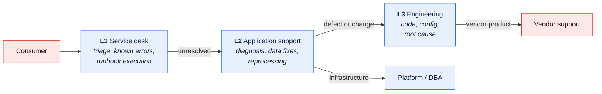

# \<Service Name\> — SLA, OLA and Support Model

> **Purpose.** What is committed, to whom, how it is measured, and what happens when it is
> missed.
>
> | | |
> | --- | --- |
> | **SLA** | Commitment to a customer or partner (external) |
> | **OLA** | Commitment between internal teams that makes the SLA achievable |
> | **UC** | Underpinning contract — a supplier's commitment to us |
>
> An SLA unsupported by OLAs and underpinning contracts cannot be met. Check the chain: if
> you commit to 4-hour resolution but your database team's OLA is next-business-day, the
> commitment is fiction.

---

## 1. Service definition

| | |
| --- | --- |
| Service | |
| Description | |
| Service owner | |
| Consumers | |
| Business hours | |
| Support hours | |
| Criticality | |

**Service components**

| Component | Provided by | Underpinning commitment | Contract |
| --- | --- | --- | --- |
| | | | |

---

## 2. Service level commitments

| ID | Metric | Commitment | Measurement | Measurement point | Exclusions | Reporting |
| --- | --- | --- | --- | --- | --- | --- |
| SLA-01 | Availability | | | | | |
| SLA-02 | Response time | | | | | |
| SLA-03 | Batch completion | | | | | |
| SLA-04 | Data delivery | | | | | |
| SLA-05 | Incident response | | | | | |
| SLA-06 | Incident resolution | | | | | |
| SLA-07 | Change notice | | | | | |

**Definitions**

| Term | Definition for this service |
| --- | --- |
| Available | *(precisely which functions must work — "the system is up" is not measurable)* |
| Downtime | |
| Planned maintenance | |
| Measurement window | |
| Measurement point | *(synthetic probe / real user / server-side — each yields a different number; pick one and state it)* |
| Business hours | |
| Business day | |

**Exclusions**

| Exclusion | Definition |
| --- | --- |
| Planned maintenance | *(with notice requirement)* |
| Consumer-caused | |
| Force majeure | |
| Third-party failure outside our control | *(name which — an unbounded exclusion makes the SLA meaningless)* |

---

## 3. Incident management

**Severity**

| Sev | Definition | Examples | Response | Update frequency | Resolution target |
| --- | --- | --- | --- | --- | --- |
| 1 | Service unavailable or data integrity compromised; business stopped | | | | |
| 2 | Major function unavailable; significant degradation | | | | |
| 3 | Minor function affected; workaround exists | | | | |
| 4 | Cosmetic; query | | | | |

> Define severity by **business impact**, never by technical component. "The database is
> slow" is not a severity; "orders cannot be dispatched before the vendor cutoff" is.

**Response vs. resolution**

| Term | Meaning |
| --- | --- |
| Response | Acknowledged and an engineer assigned |
| Mitigation | Business impact removed, possibly via workaround |
| Resolution | Underlying cause fixed and service normal |

**Escalation**

| Level | Trigger | Escalate to | Response |
| --- | --- | --- | --- |
| 1 | Raised | | |
| 2 | Not responded within target | | |
| 3 | Not mitigated within target | | |
| 4 | Sev 1 exceeding \<N\> hours | | |

---

## 4. Support model

| Level | Scope | Hours | Team | Handoff criteria |
| --- | --- | --- | --- | --- |
| L1 | | | | |
| L2 | | | | |
| L3 | | | | |

**On-call**

| Aspect | Detail |
| --- | --- |
| Rotation | |
| Coverage hours | |
| Paging mechanism | |
| Response expectation | |
| Escalation if no response | |
| Compensation/time-off policy | |

---

## 5. Operational level agreements

| ID | From | To | Commitment | Measurement | Supports |
| --- | --- | --- | --- | --- | --- |
| OLA-01 | Platform team | Application support | | | SLA-01 |
| OLA-02 | DBA team | Application support | | | SLA-01 |
| OLA-03 | Network team | | | | |
| OLA-04 | Data team | | | | SLA-04 |

**Chain check**

| SLA | Depends on | Their commitment | Sufficient? |
| --- | --- | --- | --- |
| | | | ✅/❌ |

> Every ❌ is an undeliverable commitment. Either strengthen the OLA or weaken the SLA — the
> one thing not to do is leave the gap and hope.

---

## 6. Underpinning contracts

| Supplier | Service | Their SLA | Supports | Remedy | Sufficient? |
| --- | --- | --- | --- | --- | --- |
| | | | | | ✅/❌ |

---

## 7. Maintenance

| Type | Window | Notice | Approval | Impact |
| --- | --- | --- | --- | --- |
| Routine | | | | |
| Major | | | | |
| Emergency | | | | |

**Freeze periods**

| Period | Dates | Reason | Exceptions |
| --- | --- | --- | --- |
| | | | |

---

## 8. Reporting

| Report | Contents | Audience | Frequency | Owner |
| --- | --- | --- | --- | --- |
| | | | | |

**Scorecard**

| Metric | Target | Current | Last period | Trend | Status |
| --- | --- | --- | --- | --- | --- |
| | | | | | 🟢/🟡/🔴 |

---

## 9. Breach and remedy

| Breach | Notification | Remedy | Review |
| --- | --- | --- | --- |
| Single SLA breach | | | |
| Repeated breach (≥ \<N\> in \<period\>) | | | |
| Sustained underperformance | | | |

**Service improvement plan trigger**

| Trigger | Action | Owner | Timeframe |
| --- | --- | --- | --- |
| | | | |

---

## 10. Review and change

| Aspect | Detail |
| --- | --- |
| Review cadence | |
| Participants | |
| Change process | |
| Notice for a commitment change | |
| Approval | |

---

## Change log

| Version | Date | Author | Change |
| --- | --- | --- | --- |
| 0.1.0 | | | Initial draft |
