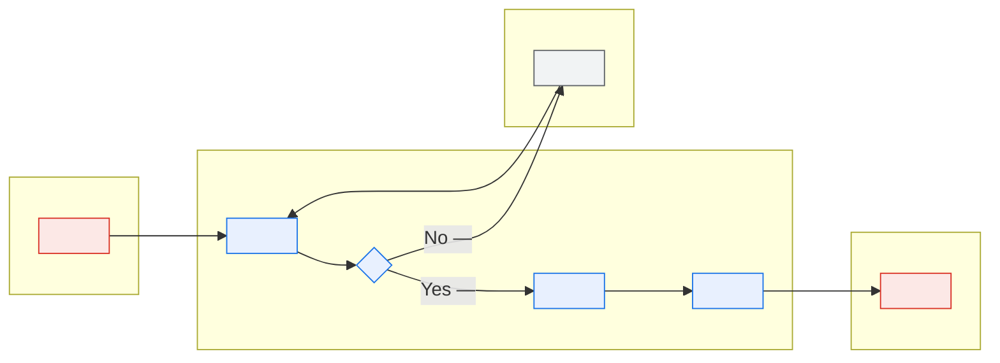
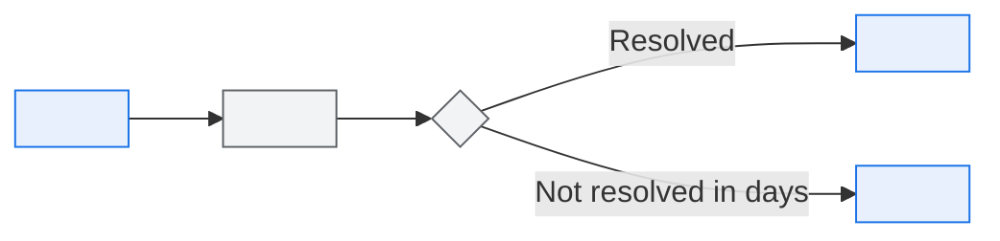

# \<Process Name\> — Business Process Flow

> **Purpose.** The end-to-end process including its exceptions, its manual steps, and its
> real timings.
>
> **Non-negotiable:** document the unhappy paths. In an established platform, 30–50% of
> volume takes a non-default route. A flow showing only the happy path implies the
> exceptions are unimportant and misleads every reader who relies on it.

---

## Contents

| Section | Summary |
| --- | --- |
| [1. Summary](#1-summary) | Process, purpose, owner, trigger, outcome, volume |
| [2. Process flow](#2-process-flow) | Swimlane flow including the unhappy path |
| [3. Steps](#3-steps) | Per-step actor, system, input, output, rules, duration, failure behaviour |
| [4. Decision points](#4-decision-points) | Decision criteria, outcomes, who decides, override rights, population split |
| [5. Exception paths](#5-exception-paths) | One block per exception: frequency, handler, how it rejoins the main flow |
| [6. Manual steps](#6-manual-steps) | Human steps with effort, reason, and risk if the person is unavailable |
| [7. Timing](#7-timing) | Segment timings and the wait states that consume most elapsed time |
| [8. Controls](#8-controls) | Preventive, detective, and corrective controls; segregation of duties |
| [9. Systems and data](#9-systems-and-data) | Systems and data touched per step, keyed to interface IDs |
| [10. Variants](#10-variants) | Differences by region, product, partner class, or customer type |
| [11. Metrics](#11-metrics) | Straight-through rate, cycle time, exception rate, with targets |
| [12. Pain points and improvement](#12-pain-points-and-improvement) | Pain points with root cause, improvement, and effort |
| [Change log](#change-log) | Version, date, author, change |

---

## 1. Summary

| | |
| --- | --- |
| Process | |
| Business purpose | |
| Process owner | |
| Trigger | |
| Outcome | |
| Frequency | |
| Volume — typical / peak | |
| Elapsed time — p50 / p95 | |
| Hands-on time | |
| Straight-through rate | *(% completing with no human intervention — the single most informative number about a process)* |

---

## 2. Process flow

---

## 3. Steps

| # | Step | Actor | System | Input | Output | Rules | Duration | Volume | Failure |
| --- | --- | --- | --- | --- | --- | --- | --- | --- | --- |
| 1 | | | | | | BR-… | | | |

### Step detail

#### Step \<N\>: \<name\>

| | |
| --- | --- |
| Actor | |
| Trigger | |
| Preconditions | |
| Action | |
| Postconditions | |
| Rules applied | |
| Data created/modified | |
| Duration — p50 / p95 | |
| Volume | |
| Automation | Automated / Semi-automated / Manual |
| Failure modes | |
| SLA | |

---

## 4. Decision points

| ID | Decision | Criteria | Outcomes | Decided by | Rules | Override |
| --- | --- | --- | --- | --- | --- | --- |
| D-01 | | | | System / Person / Both | BR-… | *(who may override, and is it logged?)* |

**Decision volumes** — how the population actually splits. This is where the happy path's
true share becomes visible.

| Decision | Outcome A | Outcome B | Outcome C |
| --- | --- | --- | --- |
| D-01 | \<%\> | \<%\> | \<%\> |

---

## 5. Exception paths

> One block per exception. Include how often it occurs, who handles it, and how it rejoins
> the main flow.

### E-\<NN\>: \<exception\>

| | |
| --- | --- |
| Trigger | |
| Frequency | *(% of volume)* |
| Detection | |
| Handler | |
| Handling procedure | |
| Rejoin point | |
| Resolution time — p50 / p95 | |
| Escalation | |
| Aged item handling | *(what happens if it is never resolved)* |
| Rules | |

**Exception summary**

| ID | Exception | Frequency | Handler | Avg. resolution | Automatable |
| --- | --- | --- | --- | --- | --- |
| | | | | | |

---

## 6. Manual steps

> Every human step, with its cost and its risk. Manual steps are where SLAs quietly die and
> where knowledge concentrates in one person.

| Step | Who | Frequency | Effort | Why manual | Risk if unavailable | Automation candidate |
| --- | --- | --- | --- | --- | --- | --- |
| | | | | | | |

**Coverage**

| Step | Primary | Backup | Documented | Bus factor |
| --- | --- | --- | --- | --- |
| | | | ✅/❌ | |

---

## 7. Timing

```mermaid
gantt
    dateFormat HH:mm
    axisFormat %H:%M
    title Typical end-to-end timing
    section Capture
    <Step>       :a1, 09:00, 5m
    section Processing
    <Step>       :a2, after a1, 30m
    <Wait>       :crit, a3, after a2, 12h
    section Completion
    <Step>       :a4, after a3, 15m
```

| Segment | p50 | p95 | Constraint | Improvement opportunity |
| --- | --- | --- | --- | --- |
| | | | | |

**Wait states** — where elapsed time is consumed without work happening. Usually the largest
component of end-to-end time, and the cheapest to attack.

| Wait | Cause | Typical duration | Avoidable |
| --- | --- | --- | --- |
| | *(batch cycle, partner response, approval queue, business hours)* | | |

---

## 8. Controls

| ID | Control | Type | Step | Owner | Frequency | Evidence |
| --- | --- | --- | --- | --- | --- | --- |
| | Preventive / Detective / Corrective | | | | | |

**Segregation of duties**

| Activity A | Activity B | Must be separate | Enforced by |
| --- | --- | --- | --- |
| | | | System / Process / Not enforced |

---

## 9. Systems and data

| Step | System | Data read | Data written | Interfaces |
| --- | --- | --- | --- | --- |
| | | | | IF-… |

---

## 10. Variants

> Where the process differs by region, product, partner class, or customer type. Variants
> are frequently undocumented and are a common source of "that's not how it works for us".

| Variant | Applies to | Differences | Volume | Rationale |
| --- | --- | --- | --- | --- |
| | | | | |

---

## 11. Metrics

| Metric | Definition | Current | Target | Source |
| --- | --- | --- | --- | --- |
| Straight-through rate | | | | |
| Cycle time p50/p95 | | | | |
| Exception rate | | | | |
| Rework rate | | | | |
| SLA adherence | | | | |
| Cost per transaction | | | | |

---

## 12. Pain points and improvement

| Pain point | Step | Impact | Frequency | Root cause | Improvement | Effort |
| --- | --- | --- | --- | --- | --- | --- |
| | | | | | | |

---

## Change log

| Version | Date | Author | Change |
| --- | --- | --- | --- |
| 0.1.0 | | | Initial draft |
