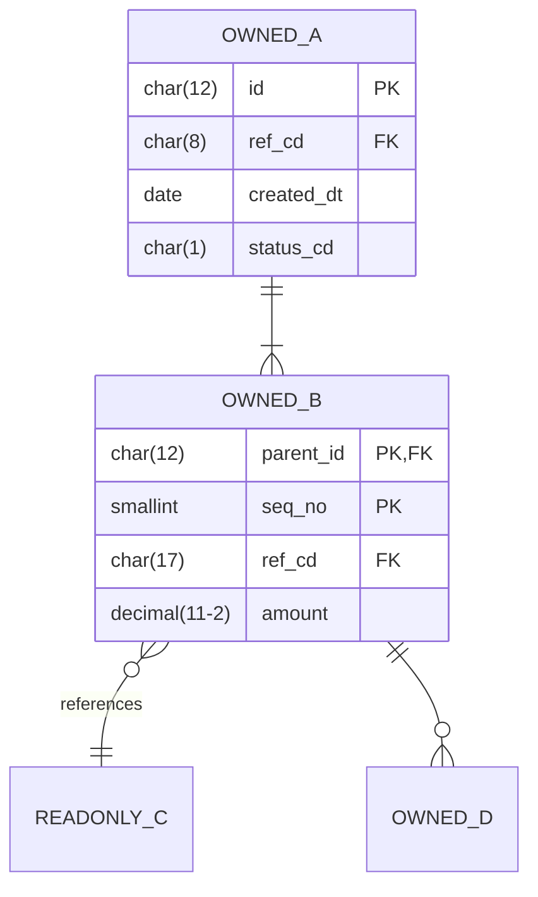

# \<Domain Name\> — Domain Data Entities

> **Purpose.** The entities this domain owns, the ones it merely reads, and how they relate.
> Bridges the domain pack to the data layer without duplicating the Data Dictionary — this
> says *what the domain does with* each entity; the dictionary says what each field *means*.

---

## 1. Entity inventory

| Entity | Ownership | Physical object | Volume | Growth | Retention | Dictionary |
| --- | --- | --- | --- | --- | --- | --- |
| | Owned / Shared / Read-only | | | | | |

**Ownership**

| Type | Meaning | Implication |
| --- | --- | --- |
| Owned | This domain defines and writes it | Change is this domain's decision |
| Shared | Written by more than one domain | Change requires joint agreement |
| Read-only | Owned elsewhere; read here | This domain must absorb upstream change |

---

## 2. Entity relationships

| Relationship | Cardinality | Key | Enforced by | Orphans present |
| --- | --- | --- | --- | --- |
| | | | FK / Application / Nothing | |

---

## 3. Owned entities

### \<ENTITY\>

| | |
| --- | --- |
| Business meaning | |
| Physical object(s) | |
| Grain | |
| Primary key | |
| Business key | |
| Created by | |
| Modified by | |
| Volume | |
| Daily creation rate | |
| Lifecycle | [SML-…](state-model-and-lifecycle.md) |
| Retention | |
| Classification | |

**Key attributes** *(the ones with domain significance; full list in the Data Dictionary)*

| Field | Meaning | Set by | Mutable | Business rules |
| --- | --- | --- | --- | --- |
| | | | | BR-… |

**Invariants** *(what must always be true — testable assertions a reviewer can check a
design against)*

| Invariant | Enforced by | Violations found |
| --- | --- | --- |
| | | |

**Consumers outside this domain**

| Consumer | Fields used | Purpose | Mechanism | Notice required for change |
| --- | --- | --- | --- | --- |
| | | | | |

---

## 4. Read-only entities

| Entity | Owned by | Fields used | Purpose | How obtained | Currency | If unavailable |
| --- | --- | --- | --- | --- | --- | --- |
| | | | | Direct read / Replica / Extract / API | | |

**Assumptions about read-only data**

> What this domain assumes about data it does not own. Each assumption is a coupling the
> owning domain may not know exists — which is precisely why it belongs in writing.

| Entity | Assumption | Owning domain aware | Risk if violated |
| --- | --- | --- | --- |
| | | ✅/❌ | |

---

## 5. Shared entities

| Entity | Co-owners | This domain writes | They write | Conflict handling | Change approval |
| --- | --- | --- | --- | --- | --- |
| | | *(which fields)* | *(which fields)* | | |

**Column-level ownership**

| Column | Physical home | Defining domain | Populated by | Change approval |
| --- | --- | --- | --- | --- |
| | | | | |

---

## 6. Reference data used

| Code set | Purpose | Owner | Volatility | Cached | Behaviour on unknown value |
| --- | --- | --- | --- | --- | --- |
| | | | | | |

---

## 7. Derived data

| Field | Derivation | Calculated by | When | Recalculated | Rules | Lineage |
| --- | --- | --- | --- | --- | --- | --- |
| | | | | | BR-… | DLN-… |

> Derived fields are where meaning is lost. Each needs a rule ID and a lineage entry; a
> derived field documented only by its column name is undocumented.

---

## 8. Data volumes

| Entity | Rows | Daily new | Daily updated | Size | Growth/year | Largest partition |
| --- | --- | --- | --- | --- | --- | --- |
| | | | | | | |

---

## 9. Data quality

| Entity | Known issues | Extent | Impact | Issue ID |
| --- | --- | --- | --- | --- |
| | | | | DI-… |

| Entity | DQ rules | Passing | Coverage gap |
| --- | --- | --- | --- |
| | | | |

---

## 10. Archival

| Entity | Active retention | Archive | Archive location | Accessible | Purge |
| --- | --- | --- | --- | --- | --- |
| | | | | | |

---

## Change log

| Version | Date | Author | Change |
| --- | --- | --- | --- |
| 0.1.0 | | | Initial draft |
