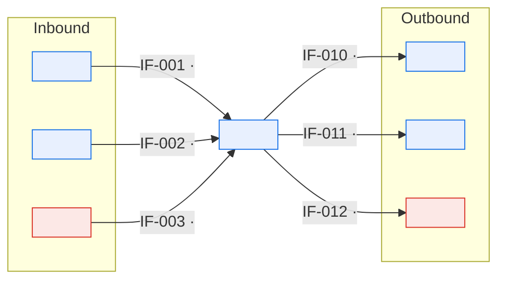

# \<Domain Name\> — Domain Interface Map

> **Purpose.** Everything this domain sends and receives, keyed to the
> [Interface Catalog](../03-interfaces/interface-catalog.md). Where the catalog is organised
> by interface, this is organised by domain — which is the view needed when assessing the
> impact of a change to this domain, or when this domain is unavailable.
>
> **Consistency requirement:** every interface here must exist in the catalog, and every
> catalog interface attributed to this domain must appear here. A mismatch means one of the
> two is stale.

---

## Contents

| Section | Summary |
| --- | --- |
| [1. Map](#1-map) | Diagram of everything the domain sends and receives |
| [2. Inbound](#2-inbound) | Inbound interfaces, what depends on them, behaviour if unavailable |
| [3. Outbound](#3-outbound) | Outbound interfaces, consumer commitments, delivery margin |
| [4. Interfaces by process step](#4-interfaces-by-process-step) | Which interface failing would stop which process step |
| [5. Data crossing the boundary](#5-data-crossing-the-boundary) | Entities, CDEs, classification, and personal data crossing the boundary |
| [6. Timing](#6-timing) | Expected times, deadlines, slack, and the critical chain |
| [7. Failure impact](#7-failure-impact) | Per-interface failure, detection time, business impact, workaround |
| [8. Manual interfaces](#8-manual-interfaces) | Human-mediated interfaces with effort and risk |
| [9. Catalog reconciliation](#9-catalog-reconciliation) | Checks that this map and the Interface Catalog agree |
| [Change log](#change-log) | Version, date, author, change |

---

## 1. Map

---

## 2. Inbound

| IF ID | Name | From | Data | Pattern | Frequency | Criticality | Used for | If unavailable |
| --- | --- | --- | --- | --- | --- | --- | --- | --- |
| | | | | | | | *(which process steps)* | |

**Dependency detail**

| IF ID | Hard/soft | Degraded behaviour | Maximum tolerable delay | Manual fallback | Fallback capacity |
| --- | --- | --- | --- | --- | --- |
| | | | | | |

> "Maximum tolerable delay" is the figure the process owner knows and the interface owner
> usually does not. Getting it written down is what turns an interface SLA from a guess into
> a requirement.

---

## 3. Outbound

| IF ID | Name | To | Data | Pattern | Frequency | Criticality | Triggered by | Impact if we fail |
| --- | --- | --- | --- | --- | --- | --- | --- | --- |
| | | | | | | | | |

**Consumer commitments**

| IF ID | Consumer | They need it by | We deliver by | Margin | Notice for change |
| --- | --- | --- | --- | --- | --- |
| | | | | | |

---

## 4. Interfaces by process step

> Connects the [process flow](business-process-flow.md) to the interfaces it depends on —
> the view that answers "which interface failing would stop this step?"

| Process step | Inbound | Outbound | Blocking |
| --- | --- | --- | --- |
| | | | Yes/No |

---

## 5. Data crossing the boundary

| IF ID | Entities | CDEs | Direction | Classification | Personal data | Transformation |
| --- | --- | --- | --- | --- | --- | --- |
| | | | | | ✅/❌ | |

---

## 6. Timing

```mermaid
gantt
    dateFormat HH:mm
    axisFormat %H:%M
    title Daily interface timing for this domain (UTC)
    section Inbound
    IF-001   :i1, 21:00, 30m
    IF-002   :i2, 22:00, 20m
    section Processing
    <domain processing> :p1, after i2, 90m
    section Outbound
    IF-010   :o1, after p1, 25m
```

| IF ID | Expected | Deadline | Depends on | Blocks | Slack |
| --- | --- | --- | --- | --- | --- |
| | | | | | |

**Critical chain** — the sequence whose delay causes this domain to miss its commitments:

---

## 7. Failure impact

| IF ID | Failure | Detection | Time to detect | Domain impact | Business impact | Workaround | Runbook |
| --- | --- | --- | --- | --- | --- | --- | --- |
| | | | | | | | |

---

## 8. Manual interfaces

| ID | Description | Counterparty | Frequency | Who | Effort | Risk |
| --- | --- | --- | --- | --- | --- | --- |
| | | | | | | |

---

## 9. Catalog reconciliation

| Check | Result | Discrepancies |
| --- | --- | --- |
| Every interface here exists in the catalog | ✅/❌ | |
| Every catalog interface for this domain appears here | ✅/❌ | |
| Criticality ratings agree | ✅/❌ | |
| Owners agree | ✅/❌ | |

Last reconciled: \<YYYY-MM-DD\> by \<role\>

---

## Change log

| Version | Date | Author | Change |
| --- | --- | --- | --- |
| 0.1.0 | | | Initial draft |
