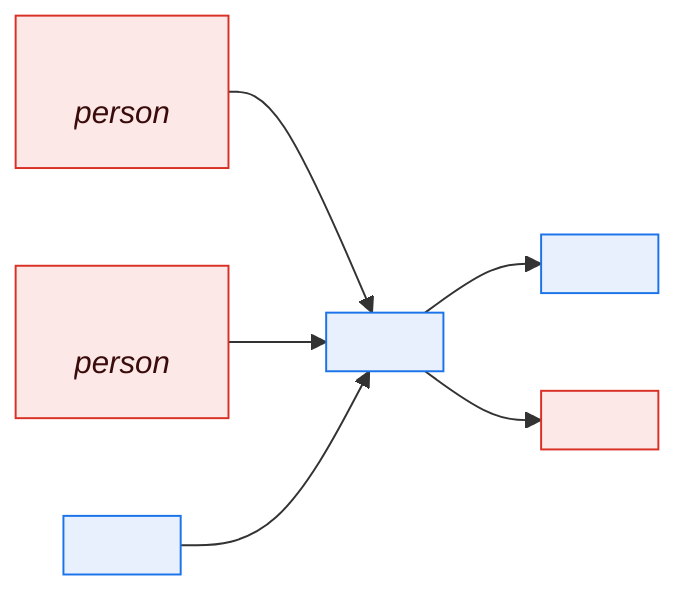
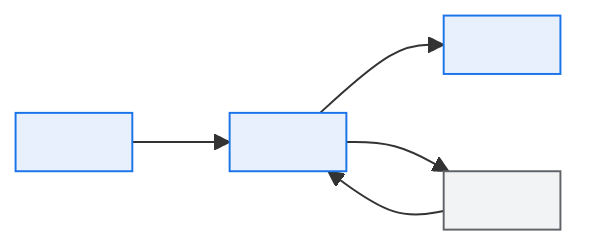

# \<Domain Name\> — Domain Overview

> **Purpose.** The entry point to a domain pack: scope, actors, capabilities, and the
> domain's place in the whole. Written for someone who has just been told they are now
> responsible for this area.
>
> **The domain pack** is six documents produced together — this, plus
> [process flows](business-process-flow.md), [rules](business-rules-catalog.md),
> [state models](state-model-and-lifecycle.md), [entities](domain-data-entities.md), and
> [interfaces](domain-interface-map.md). They are mutually consistent by construction: a
> state the process cannot reach is a defect in one of the three.

---

## 1. Scope

| | |
| --- | --- |
| Domain | |
| Domain code | |
| Business purpose | |
| Business owner | |
| Technical owner | |
| Product owner | |

**In scope**

| Area | Description |
| --- | --- |
| | |

**Out of scope** *(and who owns it)*

| Area | Owned by | Boundary rationale |
| --- | --- | --- |
| | | |

**Boundary cases** *(where the line is genuinely ambiguous and how it is resolved in
practice)*

| Case | Resolution | Decided by |
| --- | --- | --- |
| | | |

---

## 2. Business context

**Why this domain exists**

*(The business outcome it produces. If it disappeared, what would stop?)*

| Measure | Value | Notes |
| --- | --- | --- |
| Transactions/day | | |
| Value processed | | |
| Users | | |
| External parties | | |
| Peak period | | |

**Business calendar**

| Event | Timing | Impact on this domain |
| --- | --- | --- |
| | *(month-end, quarter-end, model-year changeover, launch window, peak season)* | |

---

## 3. Capabilities

| ID | Capability | Description | Volume | Criticality | Automation |
| --- | --- | --- | --- | --- | --- |
| | | | | | Full / Partial / Manual |

---

## 4. Actors

| Actor | Type | Role in the domain | Volume of interaction | System access |
| --- | --- | --- | --- | --- |
| | Internal user / External party / System / Scheduled process | | | |

---

## 5. Core concepts

> Domain vocabulary. Where a term is contested across domains, use its qualified form from
> the [Glossary](../00-foundations/glossary-and-taxonomy.md) and link to the translation
> rule — never restate a definition here, or the two will diverge.

| Concept | Definition | Glossary entry | Entity |
| --- | --- | --- | --- |
| | | | |

---

## 6. Process summary

| Process | Trigger | Outcome | Frequency | Duration | Detail |
| --- | --- | --- | --- | --- | --- |
| | | | | | [BPF-…](business-process-flow.md) |

---

## 7. Key entities

| Entity | Owned | Description | Volume | Lifecycle | Detail |
| --- | --- | --- | --- | --- | --- |
| | Owned / Read-only | | | [SML-…](state-model-and-lifecycle.md) | [DDE-…](domain-data-entities.md) |

---

## 8. Systems and components

| Component | Role in this domain | Technology | Owning team | Shared with |
| --- | --- | --- | --- | --- |
| | | | | |

---

## 9. Dependencies

**Upstream** *(what this domain needs)*

| Provider | What | Mechanism | Criticality | If unavailable |
| --- | --- | --- | --- | --- |
| | | | | |

**Downstream** *(who needs this domain)*

| Consumer | What | Mechanism | Criticality | Impact if we fail |
| --- | --- | --- | --- | --- |
| | | | | |

---

## 10. Rules summary

| Category | Rules | Volatility | Where implemented | Catalog |
| --- | --- | --- | --- | --- |
| | | High/Med/Low | *(code / configuration / reference data)* | [BRC-…](business-rules-catalog.md) |

> "Where implemented" predicts how expensive a rule change is. Rules in reference data can
> change in a day; rules in compiled code take a release cycle. Business stakeholders
> consistently assume the former, which is why the distinction belongs in the overview.

---

## 11. Known pain points

| Pain point | Impact | Frequency | Workaround | Root cause | Remediation |
| --- | --- | --- | --- | --- | --- |
| | | | | | |

**Manual effort**

| Activity | Who | Effort | Why manual | Automation candidate |
| --- | --- | --- | --- | --- |
| | | *(FTE or hours/month)* | | |

> Quantifying manual effort converts "this is painful" into a business case. It is also the
> most reliable way to find undocumented process steps — people describe what they actually
> do when asked how long it takes.

---

## 12. Domain pack

| Document | Status | Owner | Last reviewed |
| --- | --- | --- | --- |
| [Domain overview](domain-overview.md) | | | |
| [Business process flow](business-process-flow.md) | | | |
| [Business rules catalog](business-rules-catalog.md) | | | |
| [State model & lifecycle](state-model-and-lifecycle.md) | | | |
| [Domain data entities](domain-data-entities.md) | | | |
| [Domain interface map](domain-interface-map.md) | | | |

---

## Change log

| Version | Date | Author | Change |
| --- | --- | --- | --- |
| 0.1.0 | | | Initial draft |
