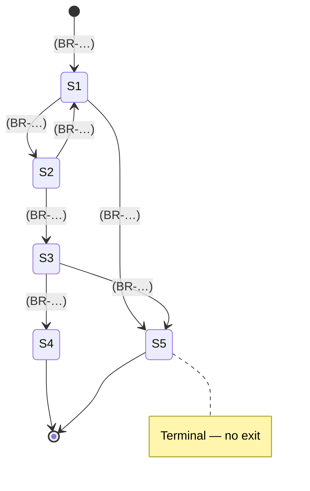

# \<Entity Name\> — State Model and Lifecycle

> **Purpose.** Every state a lifecycle-bearing entity can occupy, every legal transition,
> and the rule that causes each one. One document per entity — order, order line, hold,
> claim, objective period.
>
> **Why this earns its place.** "Why is this order stuck?" is the most common operational
> question in an order-to-cash platform. A state model with transitions labelled by rule ID
> answers it without reading code, and a state that has no exit is visible on the diagram.

---

## 1. Entity

| | |
| --- | --- |
| Entity | |
| Physical representation | *(table.column holding the state)* |
| State field | |
| Instances | |
| Typical lifetime | |
| Owning domain | |

---

## 2. State diagram

> Label every transition with the **event and rule ID**, not a bare verb. That is what makes
> the diagram checkable against the [Business Rules Catalog](business-rules-catalog.md).

---

## 3. States

| Code | State | Meaning | Entry condition | Typical duration | Exit states | Terminal | Volume (current) |
| --- | --- | --- | --- | --- | --- | --- | --- |
| | | | | | | Yes/No | |

### State detail

#### \<STATE\>

| | |
| --- | --- |
| Business meaning | |
| Entered when | |
| Typical duration — p50 / p95 | |
| Maximum acceptable duration | |
| What happens while here | |
| Visible to | |
| Permitted actions | |
| **Prohibited actions** | |
| Automatic exit | *(does anything move it out without human action?)* |
| Aged item handling | *(what happens if it stays here too long — and who notices)* |
| SLA | |

---

## 4. Transitions

| ID | From | To | Trigger | Actor | Guard conditions | Rule | Side effects | Reversible |
| --- | --- | --- | --- | --- | --- | --- | --- | --- |
| T-01 | | | | System / User / Scheduled / External | | BR-… | | |

### Transition detail

#### T-\<NN\>: \<from\> → \<to\>

| | |
| --- | --- |
| Trigger | |
| Actor | |
| Preconditions | |
| Guard conditions | |
| Rules applied | |
| Data changes | |
| Events published | |
| Notifications | |
| Downstream effects | |
| Audit record | |
| Reversible | *(and if so, how, by whom, and within what window)* |
| Failure handling | |

---

## 5. Transition matrix

> Legal transitions in a grid. It reveals impossible-to-reach and impossible-to-leave states
> immediately.

| From \ To | S1 | S2 | S3 | S4 | S5 |
| --- | --- | --- | --- | --- | --- |
| **S1** | — | T-01 | ❌ | ❌ | T-05 |
| **S2** | T-03 | — | T-02 | ❌ | T-06 |
| **S3** | ❌ | ❌ | — | T-04 | T-07 |
| **S4** | ❌ | ❌ | ❌ | — | ❌ |
| **S5** | ❌ | ❌ | ❌ | ❌ | — |

**Checks**

| Check | Result | Notes |
| --- | --- | --- |
| Every non-terminal state has at least one exit | ✅/❌ | |
| Every state is reachable from the initial state | ✅/❌ | |
| Every terminal state is correctly terminal | ✅/❌ | |
| No transition bypasses a required rule | ✅/❌ | |
| Every transition appears in the process flow | ✅/❌ | |

**Illegal transitions observed in production** ⚠️

> Query the data. In a legacy system you will find transitions the model says are impossible
> — usually caused by direct data fixes, a batch job written before a state was added, or a
> defect. Each is a finding.

| From | To | Occurrences | Period | Suspected cause | Investigation |
| --- | --- | --- | --- | --- | --- |
| | | | | | |

---

## 6. Concurrent and composite state

> Where an entity has more than one state dimension — an order line that is simultaneously
> in a processing state and carrying a hold. Model each dimension separately; the
> combination is where defects hide.

| Dimension | States | Independent | Interaction |
| --- | --- | --- | --- |
| | | Yes/No | |

**Combination rules**

| Dimension A | Dimension B | Permitted | Effective behaviour |
| --- | --- | --- | --- |
| | | ✅/❌ | |

---

## 7. Parent/child state

> Where an entity's state is derived from, or constrains, its children — an order whose
> state depends on its lines.

| Aspect | Rule |
| --- | --- |
| Parent state derivation | *(e.g. an order is `Held` if any line is held; `Dispatched` only when all lines are)* |
| Child transitions constrained by parent | |
| Parent transitions constrained by children | |
| Partial state handling | |

> Aggregate rules like "any" versus "all" are where mixed-state orders behave
> counter-intuitively, and they are almost never written down. Be explicit.

---

## 8. Timing and ageing

| State | Target duration | Alert after | Escalate after | Auto-action after | Owner |
| --- | --- | --- | --- | --- | --- |
| | | | | | |

**Current ageing**

| State | Count | Oldest | > target | > escalation |
| --- | --- | --- | --- | --- |
| | | | | |

> Run this as a query and publish it. A state with items older than anyone expected is the
> fastest route to finding a broken process, and it usually surprises the process owner.

---

## 9. Reversals and corrections

| Scenario | Permitted | Procedure | Approval | Audit | Downstream effect |
| --- | --- | --- | --- | --- | --- |
| Reverse a transition | | | | | |
| Force a state change | | | | | |
| Reopen a terminal entity | | | | | |
| Correct a state set in error | | | | | |

> Forced state changes made directly in the database bypass every side effect a normal
> transition performs — no event published, no notification, no downstream update. Document
> the procedure *and* the compensating steps, or record that it is prohibited.

---

## 10. History

| Aspect | Detail |
| --- | --- |
| State history retained | |
| Where | |
| Granularity | |
| Retention | |
| Includes actor and reason | |
| Queryable | |

---

## 11. Reporting

| State | Reported as | In which reports | Notes |
| --- | --- | --- | --- |
| | | | |

**Point-in-time state** — can the state an entity was in on a past date be reconstructed?
If not, historical operational reporting cannot be reproduced, and that is a finding for the
lineage document.

---

## Change log

| Version | Date | Author | Change |
| --- | --- | --- | --- |
| 0.1.0 | | | Initial draft |
