# \<System Name\> — Capacity and Performance Plan

> **Purpose.** What the system currently handles, what it will be asked to handle, where it
> will run out, and what to do before it does.
>
> **Batch-first framing.** In a data-intensive platform the binding constraint is usually
> not CPU or memory — it is the **batch window**. Plan against elapsed processing time
> within a fixed window, not against utilisation graphs.

---

## 1. Demand model

| Driver | Current | +6m | +12m | +24m | Basis | Confidence |
| --- | --- | --- | --- | --- | --- | --- |
| | | | | | *(business plan, historical trend, known initiative)* | ✅/🟡/🔴 |

**Business drivers of volume**

| Event | Effect on volume | Timing | Predictable |
| --- | --- | --- | --- |
| | *(new partner onboarded, product launch, market entry, promotion, model-year changeover)* | | |

---

## 2. Current utilisation

| Resource | Capacity | Typical | Peak | Utilisation at peak | Headroom | Constraint at |
| --- | --- | --- | --- | --- | --- | --- |
| Batch window | | | | | | |
| Database storage | | | | | | |
| Database I/O | | | | | | |
| Application CPU | | | | | | |
| Application memory | | | | | | |
| Network bandwidth | | | | | | |
| Message queue depth | | | | | | |
| Concurrent sessions | | | | | | |
| File transfer capacity | | | | | | |

---

## 3. Batch window capacity

> The usual binding constraint. Track elapsed time against the window, not resource
> utilisation — a job at 30% CPU that takes four hours is still the problem.

| Chain | Window | Critical path (p50) | Critical path (p95) | Slack (p95) | Utilisation | Growth/year | Breach projected |
| --- | --- | --- | --- | --- | --- | --- | --- |
| | | | | | | | |

```mermaid
gantt
    dateFormat HH:mm
    axisFormat %H:%M
    title Window utilisation — now vs. projected
    section Now (p95)
    Critical path       :a1, 22:00, 155m
    Slack               :done, a2, after a1, 145m
    section +12 months
    Critical path       :b1, 22:00, 195m
    Slack               :done, b2, after b1, 105m
    section +24 months
    Critical path       :crit, c1, 22:00, 245m
    Slack               :done, c2, after c1, 55m
```

**Jobs driving growth**

| Job | Current p95 | Growth driver | Scaling behaviour | +12m | Action |
| --- | --- | --- | --- | --- | --- |
| | | | Linear / Superlinear / Flat | | |

> Superlinear scaling is the one that surprises people. A job whose duration grows with the
> *square* of volume — a nested lookup, a non-indexed join, an in-memory sort — is fine until
> it suddenly is not. Identify these explicitly rather than extrapolating linearly.

---

## 4. Seasonal and cyclical peaks

| Peak | Timing | Multiplier | Duration | Affects | Currently handled | Headroom at peak |
| --- | --- | --- | --- | --- | --- | --- |
| | | | | | | |

**Peak preparation**

| Peak | Preparation | Lead time | Owner |
| --- | --- | --- | --- |
| | | | |

---

## 5. Performance baselines

| Operation | p50 | p95 | p99 | Max | Target | Measured | Trend |
| --- | --- | --- | --- | --- | --- | --- | --- |
| | | | | | | | |

**Degradation under load**

| Load level | Response time | Error rate | Notes |
| --- | --- | --- | --- |
| Typical | | | |
| Peak | | | |
| 2× peak | | | |
| Breaking point | | | *(what fails first — this is the useful finding)* |

---

## 6. Constraints and scaling limits

| Constraint | Current | Limit | Headroom | Type | Remediation | Lead time | Cost |
| --- | --- | --- | --- | --- | --- | --- | --- |
| | | | | Hard / Soft | | | |

**Hard limits**

> Limits that cannot be raised by adding resources — a sequence number range, a fixed-width
> field length, a 32-bit counter, a single-threaded component, a partner's daily file limit.
> These are the ones that cause outages with no warning, because utilisation graphs do not
> show them.

| Limit | Value | Current usage | Exhaustion projected | Consequence | Remediation |
| --- | --- | --- | --- | --- | --- |
| | | | | | |

> Include date and identifier ranges explicitly. A 6-digit order number exhausts at
> 1,000,000; a `char(8)` date field is a problem on a known date. Both are calculable today.

---

## 7. Growth projection

| Resource | Now | +6m | +12m | +24m | Limit | Breach | Action |
| --- | --- | --- | --- | --- | --- | --- | --- |
| | | | | | | | |

**Action triggers**

| Resource | Warning | Action | Critical | Lead time for remediation |
| --- | --- | --- | --- | --- |
| | 70% | | 85% | |

> Set triggers by lead time, not by round numbers. If procuring storage takes 12 weeks, the
> trigger must fire at whatever utilisation gives you 12 weeks of runway — which may well be
> 60%.

---

## 8. Performance improvement backlog

| ID | Opportunity | Current | Expected | Effort | Value | Priority |
| --- | --- | --- | --- | --- | --- | --- |
| | | | | | | |

---

## 9. Testing

| Test | Scenario | Load | Environment | Frequency | Last run | Result |
| --- | --- | --- | --- | --- | --- | --- |
| | | | | | | |

**Test fidelity**

| Aspect | Production | Test environment | Gap | Impact on confidence |
| --- | --- | --- | --- | --- |
| Data volume | | | | |
| Data distribution | | | | |
| Concurrency | | | | |
| Hardware | | | | |
| Interfaces | | | | |

> Data *distribution* matters as much as volume. A test dataset with evenly distributed keys
> will not reproduce the hot-partition behaviour that a production dataset with one dealer
> holding 40% of orders produces every night.

---

## 10. Monitoring

| Metric | Source | Threshold | Alert | Dashboard |
| --- | --- | --- | --- | --- |
| | | | | |

---

## Change log

| Version | Date | Author | Change |
| --- | --- | --- | --- |
| 0.1.0 | | | Initial draft |
