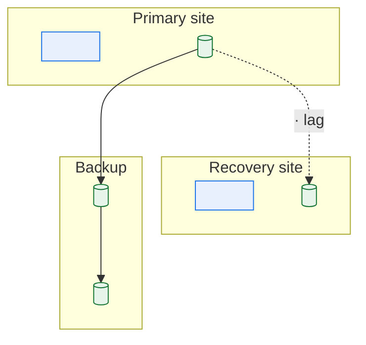

# \<System Name\> — Disaster Recovery and Business Continuity

> **Purpose.** How the system is recovered, how long it takes, how much data is lost, and
> what the business does in the meantime.
>
> **Evidence requirement.** RTO and RPO that have never been tested are estimates. Record
> the last successful test for each scenario; an untested objective is a `🔴 Assumed` claim
> in the document people will rely on during their worst day.

---

## Contents

| Section | Summary |
| --- | --- |
| [1. Objectives](#1-objectives) | RTO and RPO per capability, whether achievable, and last tested |
| [2. Business impact analysis](#2-business-impact-analysis) | Business impact by outage duration, and sensitivity to timing |
| [3. Scenarios](#3-scenarios) | Disaster scenarios with likelihood, strategy, and test status |
| [4. Architecture](#4-architecture) | Recovery site type, replication, and failover mechanism |
| [5. Backups](#5-backups) | Backup types, retention, immutability, encryption, last restore test |
| [6. Recovery procedures](#6-recovery-procedures) | Step-by-step recovery procedure per scenario |
| [7. Data reconciliation after recovery](#7-data-reconciliation-after-recovery) | Establishing the last consistent point and identifying lost transactions |
| [8. Business continuity](#8-business-continuity) | Manual continuity capacity, stated as a number rather than implied |
| [9. Communications](#9-communications) | Audiences, triggers, channels, and contacts held offline |
| [10. Testing](#10-testing) | Test types, cadence, results, and outstanding findings |
| [11. Dependencies](#11-dependencies) | Supplier DR capability, and whether their RTO is compatible with ours |
| [Change log](#change-log) | Version, date, author, change |

---

## 1. Objectives

| Capability | RTO | RPO | Business justification | Currently achievable | Last tested | Evidence |
| --- | --- | --- | --- | --- | --- | --- |
| | | | | ✅/⚠️/❌ | | |

**Definitions**

| Term | Meaning |
| --- | --- |
| RTO | Maximum acceptable time to restore the capability |
| RPO | Maximum acceptable data loss, measured in time |
| MTPD | Maximum tolerable period of disruption before unacceptable business damage |
| MBCO | Minimum business continuity objective — the reduced level of service that must be maintained |

**Gap analysis**

| Capability | Required RTO | Achievable RTO | Gap | Cause | Remediation | Cost | Accepted by |
| --- | --- | --- | --- | --- | --- | --- | --- |
| | | | | | | | |

---

## 2. Business impact analysis

| Process | Criticality | MTPD | Peak sensitivity | Impact at 4h | Impact at 24h | Impact at 1 week |
| --- | --- | --- | --- | --- | --- | --- |
| | | | *(month-end, model-year changeover, quarter close)* | | | |

**Timing dependency** — the same outage has very different consequences depending on when it
happens. An hour lost at 02:30 during the nightly batch misses the vendor cutoff and delays
a full day of dispatches; the same hour at 14:00 is an inconvenience. Record which windows
are unforgiving.

| Window | Why sensitive | Consequence of an outage here |
| --- | --- | --- |
| | | |

---

## 3. Scenarios

| ID | Scenario | Likelihood | Impact | RTO | Strategy | Tested |
| --- | --- | --- | --- | --- | --- | --- |
| DR-01 | Application server loss | | | | | |
| DR-02 | Database loss | | | | | |
| DR-03 | Site loss | | | | | |
| DR-04 | Data corruption (detected immediately) | | | | | |
| DR-05 | Data corruption (detected days later) | | | | | |
| DR-06 | Ransomware / destructive attack | | | | | |
| DR-07 | Critical third party unavailable | | | | | |
| DR-08 | Key personnel unavailable | | | | | |
| DR-09 | Batch window missed entirely | | | | | |
| DR-10 | Network/connectivity loss | | | | | |

> DR-05 is the scenario most plans handle worst. Corruption discovered a week later means
> restoring to a point before it — which discards a week of legitimate transactions.
> Document the reconciliation and replay approach, because "restore from backup" alone is
> not a recovery.

---

## 4. Architecture

| Aspect | Detail |
| --- | --- |
| Recovery site type | Hot / Warm / Cold |
| Replication | |
| Replication lag — typical / max | |
| Failover | Automatic / Manual |
| Failback | |
| Capacity at the recovery site | *(% of production — if less, state what is degraded)* |
| Data not replicated | *(be explicit — this is the real RPO)* |

---

## 5. Backups

| Asset | Type | Frequency | Retention | Location | Immutable | Encrypted | Last restore test |
| --- | --- | --- | --- | --- | --- | --- | --- |
| | Full / Incremental / Log / Snapshot | | | | ✅/❌ | ✅/❌ | |

**Restore times**

| Asset | Size | Restore duration | Tested | Notes |
| --- | --- | --- | --- | --- |
| | | | | |

> Restore duration is the number that determines whether the RTO is real, and it is
> routinely unmeasured. Measure it at production scale — restoring a 4 TB database is not a
> linear scale-up from a 40 GB test.

**Assets NOT backed up** ⚠️

| Asset | Why | Risk | Recovery approach |
| --- | --- | --- | --- |
| | | | |

> Commonly missed: scheduler definitions, configuration held outside the application,
> certificates, SFTP keys, reference data maintained by hand, interface mapping tables.
> These are small, unglamorous, and block recovery entirely when absent.

---

## 6. Recovery procedures

### DR-\<NN\>: \<scenario\>

| | |
| --- | --- |
| Trigger | |
| Declared by | |
| Decision criteria | |
| RTO / RPO | |
| Prerequisites | |

**Steps**

| # | Action | Owner | Duration | Verification | Rollback |
| --- | --- | --- | --- | --- | --- |
| 1 | | | | | |

**Post-recovery verification**

| # | Check | Expected |
| --- | --- | --- |
| 1 | Application responds | |
| 2 | Data current to \<point\> | |
| 3 | Interfaces reconnected | |
| 4 | Batch schedule restored | |
| 5 | Reconciliation against external parties | |
| 6 | No duplicate processing | |
| 7 | In-flight transactions accounted for | |

> Checks 5–7 are where recovery goes wrong. A recovered system that re-sends yesterday's
> dispatch file creates duplicate shipments, and reconciliation against counterparties is
> the only way to find out before they do.

---

## 7. Data reconciliation after recovery

| Aspect | Approach |
| --- | --- |
| Determining the last consistent point | |
| Identifying transactions lost | |
| Identifying transactions that may have been processed twice | |
| Re-sourcing lost data | |
| Reconciling with external parties | |
| Handling partner transmissions sent before the failure | |
| Restating downstream reports | |

**Interface recovery**

| Interface | Replay possible | Replay window | Duplicate risk | Counterparty coordination |
| --- | --- | --- | --- | --- |
| | | | | |

---

## 8. Business continuity

> What the business does while the system is unavailable. Manual continuity capacity is
> almost always far below normal volume — state the number rather than implying the process
> simply continues.

| Process | Manual workaround | Capacity | Duration sustainable | Owner | Backlog recovery |
| --- | --- | --- | --- | --- | --- |
| | | *(transactions/day vs. normal)* | | | |

**Backlog recovery**

| Outage duration | Backlog accumulated | Time to clear | Constraint |
| --- | --- | --- | --- |
| 4 hours | | | |
| 1 day | | | |
| 1 week | | | |

---

## 9. Communications

| Audience | Trigger | Channel | Owner | Template |
| --- | --- | --- | --- | --- |
| | | | | |

**Contacts** *(maintained offline — a contact list stored only in the system being recovered
is unavailable exactly when needed)*

| Role | Primary | Deputy | Offline copy held |
| --- | --- | --- | --- |
| | | | |

---

## 10. Testing

| Test | Scenario | Type | Frequency | Last | Result | Next |
| --- | --- | --- | --- | --- | --- | --- |
| | | Tabletop / Component / Partial failover / Full failover | | | | |

**Last test findings**

| Finding | Impact on RTO/RPO | Remediation | Owner | Status |
| --- | --- | --- | --- | --- |
| | | | | |

**Untested elements**

| Element | Why untested | Risk | Plan |
| --- | --- | --- | --- |
| | | | |

---

## 11. Dependencies

| Dependency | Their DR capability | Their RTO | Compatible with ours | Contract | Tested jointly |
| --- | --- | --- | --- | --- | --- |
| | | | | | |

> Your RTO cannot be shorter than that of any hard dependency. Where a supplier's RTO
> exceeds your commitment, either the commitment is wrong or a contingency is needed — say
> which.

---

## Change log

| Version | Date | Author | Change |
| --- | --- | --- | --- |
| 0.1.0 | | | Initial draft |
