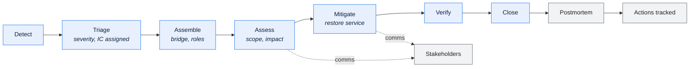

# \<System Name\> — Incident Response and Postmortem

> Two parts: the **process** (§1–6) defining how incidents are run, and the **postmortem
> template** (§7) copied per incident.

---

## Contents

| Section | Summary |
| --- | --- |
| [1. Severity](#1-severity) | Severity ladder with declaration criteria, response, comms, postmortem requirement |
| [2. Roles](#2-roles) | Incident Commander, Operations Lead, Comms, Scribe — and who holds each |
| [3. Process](#3-process) | Detect, triage, contain, resolve, recover phases with owners and timeboxes |
| [4. Communications](#4-communications) | Audience, channel, and cadence per severity |
| [5. Data integrity incidents](#5-data-integrity-incidents) | Data-integrity incidents: stop propagation, assess extent, correct, notify |
| [6. Metrics](#6-metrics) | Time to detect, acknowledge, mitigate, resolve — with targets |
| [7. Postmortem template](#7-postmortem-template) | Blameless postmortem structure, copied per incident |
| [Change log](#change-log) | Version, date, author, change |

---

## 1. Severity

| Sev | Definition | Examples | Declare | Response | Comms | Postmortem |
| --- | --- | --- | --- | --- | --- | --- |
| 1 | Business process stopped; data integrity compromised; regulatory exposure | | | | | Mandatory |
| 2 | Major degradation; SLA breach; significant manual workaround | | | | | Mandatory |
| 3 | Minor impact; workaround available | | | | | Optional |
| 4 | No business impact | | | | | No |

**Severity by business impact, never by component.** "The database is slow" is not a
severity; "orders cannot be dispatched before the vendor cutoff" is. Include data-integrity
incidents at Sev 1 even when everything is up — a system producing confident wrong answers
is worse than one that has stopped.

**Escalation of severity**

| Trigger | New severity |
| --- | --- |
| Not mitigated within \<N\> | |
| External party affected | |
| Financial impact confirmed | |
| Data transmitted externally in error | |

---

## 2. Roles

| Role | Responsibility | Who |
| --- | --- | --- |
| Incident Commander | Runs the incident; makes decisions; does not debug | |
| Operations Lead | Directs the technical work | |
| Communications Lead | Updates stakeholders | |
| Subject Matter Experts | Investigate and fix | |
| Scribe | Timeline and decisions | |
| Business Liaison | Assesses and represents business impact | |

> The Incident Commander must not also be debugging. The moment they do, nobody is tracking
> the whole picture — and that is when the second failure gets missed.

---

## 3. Process



| Phase | Objective | Owner | Timebox |
| --- | --- | --- | --- |
| Detect | | | |
| Triage | | | |
| Assemble | | | |
| Assess | Scope and business impact — **before** fixing | | |
| Mitigate | Restore service; workarounds acceptable | | |
| Verify | Confirm resolution and data consistency | | |
| Close | | | |
| Postmortem | | | |

**Mitigate before you diagnose.** Restoring service takes priority over understanding the
cause — except where mitigation would destroy the evidence needed to understand it. When
that trade-off arises, the IC decides and the scribe records it.

---

## 4. Communications

| Audience | Sev 1 | Sev 2 | Channel | Owner |
| --- | --- | --- | --- | --- |
| Engineering | | | | |
| Business stakeholders | | | | |
| Executive | | | | |
| Support/service desk | | | | |
| External partners | | | | |
| Customers | | | | |
| Regulator | | | | |

**Update template**

```
[SEV <n>] <system> — <one-line impact>
Status: Investigating / Identified / Mitigating / Monitoring / Resolved
Business impact: <what cannot be done right now, and by whom>
Started: <time> · Duration: <elapsed>
Current action: <what is happening now>
Next update: <time>
IC: <name>
```

> Lead with business impact, not technical state. "Dispatch file to vendors has not been
> sent; ~2,400 orders affected; vendor cutoff is 03:00" tells a stakeholder what to do.
> "MQ channel down" does not.

---

## 5. Data integrity incidents

> A distinct class needing different handling: service may be fine while the data is wrong.

| Step | Action |
| --- | --- |
| 1 | Stop further propagation — pause affected jobs and interfaces |
| 2 | Determine scope: which records, which period, which consumers |
| 3 | Determine whether bad data has left the system |
| 4 | Notify affected consumers **before** correcting, so they can suspend their processing |
| 5 | Preserve evidence — snapshot the affected data before correction |
| 6 | Correct with an auditable method; never an ad-hoc `UPDATE` without a record |
| 7 | Verify against an independent source |
| 8 | Coordinate downstream reprocessing and restatement |
| 9 | Raise a data issue log entry for the permanent record |

**Externally transmitted bad data**

| Question | Answer needed |
| --- | --- |
| What was sent, to whom, when? | |
| Can it be recalled or corrected? | |
| What will they do with it if not corrected? | |
| Contractual notification obligation? | |
| Financial consequence? | |

---

## 6. Metrics

| Metric | Definition | Target | Current |
| --- | --- | --- | --- |
| Time to detect | Start → detection | | |
| Time to acknowledge | | | |
| Time to mitigate | | | |
| Time to resolve | | | |
| % detected by monitoring | | | |
| % with a usable runbook | | | |
| Repeat incidents | | | |
| Action completion rate | | | |

> "% detected by monitoring" is the health indicator for observability, and "% with a usable
> runbook" for operational documentation. Both are more useful than incident count, which
> mostly tracks change volume.

---

## 7. Postmortem template

> Copy per incident. **Blameless:** describe what people did given the information they had
> at the time. Systems that allow a single mistake to cause an incident are the defect —
> people making mistakes is a constant.

### Incident \<ID\>: \<title\>

| | |
| --- | --- |
| Date | |
| Severity | |
| Duration | |
| Detected by | |
| Time to detect | |
| Time to mitigate | |
| IC | |
| Author | |
| Review date | |

**Summary** *(a paragraph a stakeholder can read)*

**Business impact**

| Dimension | Impact |
| --- | --- |
| Processes affected | |
| Transactions affected | |
| Customers/partners affected | |
| Financial impact | |
| Data integrity impact | |
| Regulatory impact | |
| Manual effort to recover | |

**Timeline**

| Time | Event | Actor | Notes |
| --- | --- | --- | --- |
| | | | |

> Include the time the problem started, not only when it was detected. The gap between them
> is the observability finding.

**Root cause**

| Aspect | Finding |
| --- | --- |
| Trigger | |
| Root cause | |
| Contributing factors | |
| Why it was not prevented | |
| Why it was not detected sooner | |
| Why it took as long as it did to mitigate | |

**Contributing factors**

| Category | Factor |
| --- | --- |
| Design | |
| Testing | |
| Monitoring | |
| Documentation | |
| Process | |
| Knowledge | |
| Tooling | |
| Dependency | |

**What went well**

**What was difficult**

**Where we got lucky** *(the near-misses — what would have made this much worse, and how
close it came. Often the most valuable section, and the one most often omitted.)*

**Actions**

| ID | Action | Type | Addresses | Owner | Priority | Due | Status |
| --- | --- | --- | --- | --- | --- | --- | --- |
| | | Prevent / Detect / Mitigate / Document | | | | | |

> Every postmortem should produce at least one **detect** action. If the incident was found
> by a person rather than an alert, that is a gap regardless of how the cause is fixed.

**Related incidents** *(has this happened before? If so, why did the previous actions not
prevent it?)*

| Incident | Date | Similarity | Actions then | Effective |
| --- | --- | --- | --- | --- |
| | | | | |

---

## Change log

| Version | Date | Author | Change |
| --- | --- | --- | --- |
| 0.1.0 | | | Initial draft |
