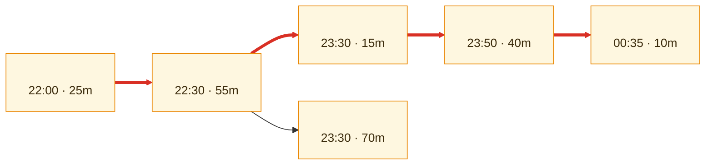

# \<System Name\> — Job Schedule Catalog

> **Purpose.** Every scheduled job with its dependencies, window, failure action, and restart
> semantics. The operational counterpart to the
> [Batch & Scheduling Architecture](../01-architecture/batch-and-scheduling-architecture.md):
> that explains the design, this is what someone consults at 02:00 when a job has abended.

---

## Contents

| Section | Summary |
| --- | --- |
| [1. Summary](#1-summary) | Job count, scheduler, and where schedule definitions live |
| [2. Catalog](#2-catalog) | One row per job: schedule, trigger, duration, dependencies, restart safety, runbook |
| [3. Job detail](#3-job-detail) | Per-job detail for jobs needing more than a catalog row |
| [4. Dependency graph](#4-dependency-graph) | Dependency graph with the critical path, its duration, and slack |
| [5. Schedule timeline](#5-schedule-timeline) | Schedule as a timeline across the processing window |
| [6. By window](#6-by-window) | Jobs per window, must-finish times, actual p95 finish, slack, risk |
| [7. Special schedules](#7-special-schedules) | Weekly, month-end, and calendar-driven schedules, with terms defined precisely |
| [8. Jobs requiring care ⚠️](#8-jobs-requiring-care-) | Jobs an on-call engineer must not restart casually, and the correct procedure |
| [9. Manual interventions](#9-manual-interventions) | Recurring manual interventions and why they remain manual |
| [10. Performance history](#10-performance-history) | Duration trends, failure counts, and jobs approaching their window |
| [11. Retired jobs](#11-retired-jobs) | Retired jobs and whether the definition was removed from the scheduler |
| [Change log](#change-log) | Version, date, author, change |

---

## 1. Summary

| | |
| --- | --- |
| Total jobs | |
| Scheduler | |
| Schedule definition location | |
| Version controlled | ✅/❌ |
| Timezone | |
| DST handling | |
| Jobs in the critical path | |
| Jobs with no documented restart procedure | |
| Jobs that must never be blindly re-run | |

---

## 2. Catalog

| Job ID | Name | Purpose | Schedule | Trigger | Duration (p50/p95) | Predecessors | Successors | Critical path | Crit | Owner | Restart | Runbook |
| --- | --- | --- | --- | --- | --- | --- | --- | --- | --- | --- | --- | --- |
| | | | | Time / File / Event / Predecessor / Manual | | | | ✅/❌ | 1/2/3 | | Safe / Conditional / **Never** | |

---

## 3. Job detail

### \<JOB-ID\>: \<name\>

| | |
| --- | --- |
| Purpose | |
| Owner | |
| Criticality | |
| Schedule | |
| Trigger | |
| Calendar | *(every day / business days / month-end / conditional)* |
| Duration — p50 / p95 / max observed | |
| Must complete by | |
| Cutoff driver | |

**Dependencies**

| Type | Item | Blocking | If missing |
| --- | --- | --- | --- |
| Predecessor job | | | |
| Input file | | | |
| Database availability | | | |
| External system | | | |
| Reference data currency | | | |

**Outputs**

| Output | Destination | Consumers | Size | If not produced |
| --- | --- | --- | --- | --- |
| | | | | |

**Resources**

| Resource | Typical | Peak | Contention with |
| --- | --- | --- | --- |
| | | | |

**Restart and recovery** ⚠️

| | |
| --- | --- |
| Re-runnable | Safe / Conditional / **Never without cleanup** |
| Restart point | From start / Checkpoint / Manual position |
| Idempotent | |
| Pre-restart cleanup | |
| **Consequence of a double run** | *(be specific — "duplicate GL postings for the affected period" is actionable; "data issues" is not)* |
| Recovery procedure | |
| Maximum safe delay | |
| Catch-up strategy | |

**Failure handling**

| Failure | Automatic action | Manual action | Escalate after | Downstream impact |
| --- | --- | --- | --- | --- |
| Abend | | | | |
| Overrun | | | | |
| Input missing | | | | |
| Input malformed | | | | |
| Zero records | | | | |
| Volume anomaly | | | | |

**Monitoring**

| Signal | Threshold | Alert to |
| --- | --- | --- |
| Job failed | | |
| Job running longer than p95 | | |
| Job did not start by \<time\> | | |
| Output not produced | | |
| Volume outside expected range | | |

> "Job did not start" needs its own alert. A job that never starts produces no failure
> event, and the omission is silent until a downstream process finds nothing to read.

---

## 4. Dependency graph

**Critical path:** \<sequence\> — \<duration\> against a \<time\> cutoff, \<slack\> slack.

---

## 5. Schedule timeline

```mermaid
gantt
    dateFormat HH:mm
    axisFormat %H:%M
    title Nightly schedule (UTC)
    section Extract
    <JOB-1>    :j1, 22:00, 25m
    section Core
    <JOB-2>    :j2, after j1, 55m
    <JOB-3>    :j3, after j2, 15m
    section Distribute
    <JOB-5>    :j5, after j3, 40m
    <JOB-6>    :crit, j6, after j5, 10m
```

---

## 6. By window

| Window | Jobs | Start | Must finish | Actual finish (p95) | Slack | Risk |
| --- | --- | --- | --- | --- | --- | --- |
| | | | | | | |

---

## 7. Special schedules

| Schedule | Jobs | Timing | Calendar rule | Notes |
| --- | --- | --- | --- | --- |
| Weekly | | | | |
| Month-end | | | *(define "month-end" precisely — last calendar day, last business day, or period close)* | |
| Quarter-end | | | | |
| Year-end | | | | |
| On-demand | | | | |

---

## 8. Jobs requiring care ⚠️

> The list an on-call engineer should read before touching anything.

| Job | Why | Correct procedure | Approval needed |
| --- | --- | --- | --- |
| | *(financial posting, external transmission, sequence consumption, payment file, irreversible state change)* | | |

---

## 9. Manual interventions

| Intervention | Job | Frequency | Who | Procedure | Why still manual | Automation candidate |
| --- | --- | --- | --- | --- | --- | --- |
| | | | | | | |

---

## 10. Performance history

| Job | p50 | p95 | Max | Trend | Failures (90d) | Action |
| --- | --- | --- | --- | --- | --- | --- |
| | | | | | | |

**Jobs approaching their window**

| Job | Window | p95 | Utilisation | Projected breach | Action |
| --- | --- | --- | --- | --- | --- |
| | | | | | |

---

## 11. Retired jobs

| Job | Retired | Reason | Replaced by | Definition removed from scheduler |
| --- | --- | --- | --- | --- |
| | | | | ✅/❌ |

> A disabled-but-present job definition is a hazard: it can be re-enabled by accident during
> a recovery, and it clutters dependency analysis. Remove definitions, and record that you
> did.

---

## Change log

| Version | Date | Author | Change |
| --- | --- | --- | --- |
| 0.1.0 | | | Initial draft |
