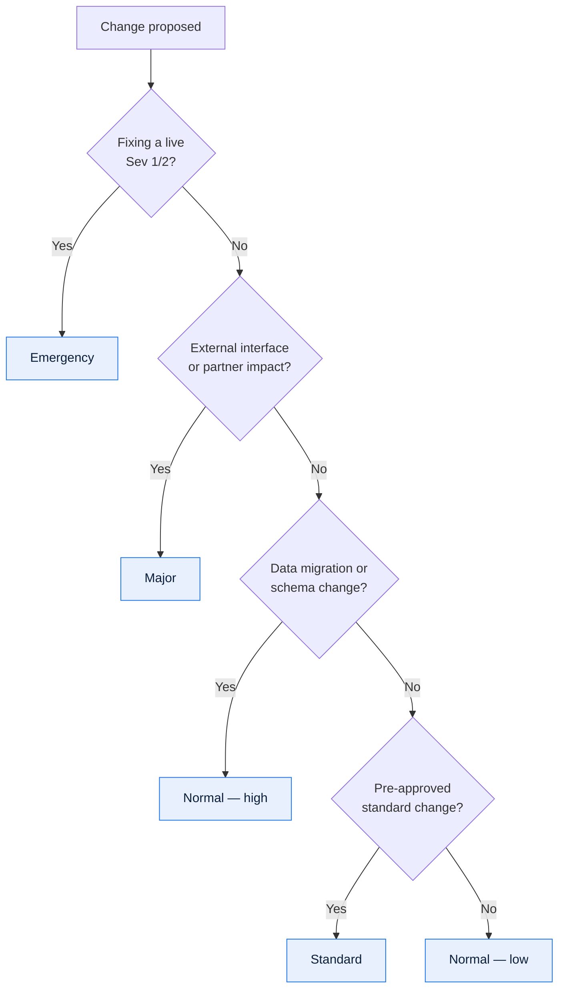
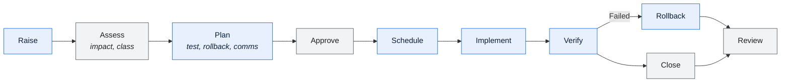

# \<System Name\> — Release and Change Management

> **Purpose.** How change reaches production: the classes of change, the gates each passes,
> and the deployment and rollback procedures.
>
> **Calibrate the process to the risk.** A uniform heavyweight process for every change
> makes low-risk changes expensive and tempts people to route around it — which is how the
> genuinely risky changes end up unreviewed.

---

## Contents

| Section | Summary |
| --- | --- |
| [1. Change classes](#1-change-classes) | Change classes with approval, lead time, window, testing, rollback requirement |
| [2. Process](#2-process) | Stages from request to closure, with owners and exit criteria |
| [3. Change record](#3-change-record) | The change record and its required fields |
| [4. Approval](#4-approval) | Approvers per class across technical, business, security, data governance |
| [5. Windows and freezes](#5-windows-and-freezes) | Permitted windows, change classes allowed, freeze periods and exceptions |
| [6. Deployment](#6-deployment) | Per-component deployment method, verification, rollback, and the runsheet |
| [7. Rollback](#7-rollback) | Rollback triggers, decision owner, deadline, and procedure |
| [8. Verification](#8-verification) | Post-deployment checks, method, expected result, timing |
| [9. Post-implementation review](#9-post-implementation-review) | Post-implementation review questions |
| [10. Metrics](#10-metrics) | Change success rate, emergency change share, failed-change rate |
| [Change log](#change-log) | Version, date, author, change |

---

## 1. Change classes

| Class | Definition | Approval | Lead time | Window | Testing | Rollback required |
| --- | --- | --- | --- | --- | --- | --- |
| Standard | Pre-approved, repeatable, low risk | | | | | |
| Normal — low | Routine, limited blast radius | | | | | |
| Normal — high | Multi-component, data migration, or external impact | | | | | |
| Major | Architecture, interface contract, or cutover | | | | | |
| Emergency | Fixing a live incident | | | | | |

**Classification**

---

## 2. Process

| Stage | Owner | Inputs | Exit criteria |
| --- | --- | --- | --- |
| | | | |

---

## 3. Change record

| | |
| --- | --- |
| Change ID | |
| Title | |
| Class | |
| Requester | |
| Implementer | |
| Business justification | |
| Related BRD/HLD/incident | |
| Proposed window | |
| Duration | |
| Downtime required | |

**Impact**

| Dimension | Impact |
| --- | --- |
| Components | |
| Interfaces | |
| Data | |
| Batch schedule | |
| Reports | |
| External parties | |
| Users | |
| Documents requiring update | |

Full analysis: [Impact Assessment](../06-change/impact-assessment.md).

**Risk**

| Risk | Likelihood | Impact | Mitigation |
| --- | --- | --- | --- |
| | | | |

| | |
| --- | --- |
| Reversible | Yes / No / Time-limited |
| Rollback window | |
| Point of no return | *(the step after which rollback is no longer possible — name it explicitly)* |

---

## 4. Approval

| Class | Technical | Business | Change board | Security | Data governance |
| --- | --- | --- | --- | --- | --- |
| Standard | | | | | |
| Normal — low | | | | | |
| Normal — high | | | | | |
| Major | | | | | |
| Emergency | | | | | |

**Emergency changes** — approved retrospectively, never unreviewed:

| Step | Timing |
| --- | --- |
| Verbal/chat approval from the on-call approver | Before implementation |
| Change record raised | Within \<N\> hours |
| Retrospective review | Next change board |
| Post-implementation review | Within \<N\> days |

---

## 5. Windows and freezes

| Window | When | Classes permitted | Approval |
| --- | --- | --- | --- |
| | | | |

**Freeze periods**

| Period | Dates | Reason | Exception process |
| --- | --- | --- | --- |
| | *(month-end close, quarter-end settlement, model-year changeover, peak season)* | | |

---

## 6. Deployment

| Component | Method | Downtime | Duration | Verification | Rollback | Rollback duration |
| --- | --- | --- | --- | --- | --- | --- |
| | | | | | | |

**Runsheet template**

| # | Step | Owner | Start | Duration | Verification | Go/no-go |
| --- | --- | --- | --- | --- | --- | --- |
| 1 | Pre-checks | | | | | |
| 2 | Notify stakeholders | | | | | |
| 3 | Backup / snapshot | | | | | ✅ |
| 4 | Disable affected jobs | | | | | |
| 5 | Deploy | | | | | |
| 6 | Database migration | | | | | ✅ |
| 7 | Smoke test | | | | | ✅ |
| 8 | Re-enable jobs | | | | | |
| 9 | Verify | | | | | ✅ |
| 10 | Notify completion | | | | | |

---

## 7. Rollback

| | |
| --- | --- |
| Trigger criteria | |
| Decision owner | |
| Decision deadline | |
| Procedure | |
| Duration | |
| Data implications | *(what happens to records created since deployment)* |
| Point of no return | |
| Communication | |

> **Data written after deployment is what makes rollback hard.** If the new version writes
> records in a format the old version cannot read, rollback is not a code revert — it is a
> migration. Decide this at design time, not in the window.

---

## 8. Verification

| # | Check | Method | Expected | Owner | Timing |
| --- | --- | --- | --- | --- | --- |
| 1 | Application healthy | | | | Immediate |
| 2 | Key transactions succeed | | | | Immediate |
| 3 | Interfaces functioning | | | | Immediate |
| 4 | Batch jobs complete | | | | Next cycle |
| 5 | Reconciliation passes | | | | Next cycle |
| 6 | No error rate increase | | | | 24h |
| 7 | Performance within NFR | | | | 24h |

---

## 9. Post-implementation review

| Question | Answer |
| --- | --- |
| Delivered as planned? | |
| Within the window? | |
| Issues encountered | |
| Rollback required? | |
| Verification complete? | |
| Documentation updated? | |
| Lessons | |

---

## 10. Metrics

| Metric | Definition | Target | Current |
| --- | --- | --- | --- |
| Change success rate | | | |
| Emergency change % | | | |
| Rollback rate | | | |
| Change-caused incidents | | | |
| Lead time | | | |
| Deployment frequency | | | |
| Changes with documentation updated | | | |

> A high emergency-change proportion usually means the normal process is too slow rather
> than that the system is unstable. Investigate the cause before tightening the emergency
> path.

---

## Change log

| Version | Date | Author | Change |
| --- | --- | --- | --- |
| 0.1.0 | | | Initial draft |
