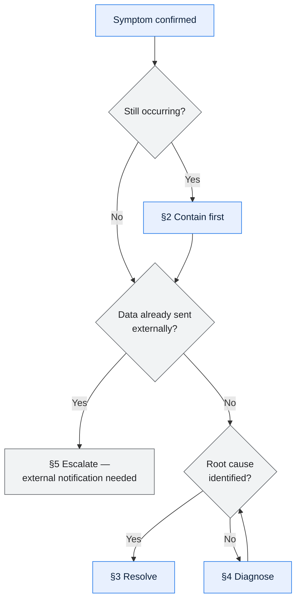

# \<Procedure Name\> — Runbook

> **Audience.** Someone with no context, at 03:00, who has been paged. Write for them.
>
> **Test.** A runbook is finished when someone unfamiliar with the subsystem executes it end
> to end without escalating. Anything less is a checklist of things the author already knew.
>
> **Second person, imperative, numbered steps.** Every mutating step states its risk and its
> undo before it is performed, not after.

---

## Contents

| Section | Summary |
| --- | --- |
| [When to use this](#when-to-use-this) | Triggering alerts, symptoms, and the situations this runbook does not cover |
| [Before you start](#before-you-start) | Access, tools, and approvals needed before starting |
| [1. Assess](#1-assess) | Confirm the symptom and establish scope before acting |
| [2. Contain](#2-contain) | Stop the problem growing before diagnosing it |
| [3. Resolve](#3-resolve) | The corrective steps, with expected output at each check |
| [4. Diagnose](#4-diagnose) | Ordered checks for when the cause is not obvious |
| [5. Escalate](#5-escalate) | Escalation triggers, routes, and expected response |
| [6. Verify](#6-verify) | Confirm the symptom cleared and downstream effects are correct |
| [7. After](#7-after) | Ticket updates, consumer notification, follow-up actions |
| [Related information](#related-information) | Architecture, component spec, job catalog, interface references |
| [Execution log](#execution-log) | Every real execution recorded, so procedure drift becomes visible |
| [Change log](#change-log) | Version, date, author, change |

---

## When to use this

| | |
| --- | --- |
| Triggering alert(s) | |
| Symptoms | |
| **Do not use this if** | *(the nearest similar situation and the runbook for it)* |
| Related runbooks | |
| Expected duration | |
| Severity | |

---

## Before you start

**Access required**

| Access | How to get it | If you don't have it |
| --- | --- | --- |
| | | |

**Tools required**

| Tool | Where | Notes |
| --- | --- | --- |
| | | |

**Approvals required**

| Action | Approver | How to reach them | Can it wait? |
| --- | --- | --- | --- |
| | | | |

> ⚠️ **Risks in this procedure**
>
> | Step | Risk | Consequence |
> | --- | --- | --- |
> | | *(financial posting, external transmission, data loss, irreversible)* | |

---

## 1. Assess

**1.1 Confirm the symptom**

```bash
# Command to run
```

Expected output:

```
```

| If you see | Then |
| --- | --- |
| | Continue to 1.2 |
| | Go to §5 — Escalation |
| | This is a different problem — use \<runbook\> |

**1.2 Determine scope**

```bash
```

| Question | How to answer | Record it |
| --- | --- | --- |
| How many records/transactions affected? | | |
| Since when? | | |
| Is it still happening? | | |
| Are downstream systems affected? | | |
| Has data been transmitted externally? | | |

> Establish scope **before** acting. A fix applied without knowing the blast radius often
> makes recovery harder — especially if bad data has already left the building.

**1.3 Decide the path**



---

## 2. Contain

> Stop it getting worse. Containment before diagnosis — a growing problem is harder to
> recover from than a stopped one.

**2.1 \<Action\>**

> ⚠️ **This step \<is / is not\> reversible.** \<Undo procedure, or why not.\>

```bash
```

Expected result:

```
```

Verify:

```bash
```

| If | Then |
| --- | --- |
| Succeeded | Continue |
| Failed | §5 Escalation |

---

## 3. Resolve

**3.1 \<Action\>**

```bash
```

| Check | Expected |
| --- | --- |
| | |

**3.2 \<Action\>**

> 💰 **Financial risk.** *(e.g. re-running this job after it partially completed creates
> duplicate GL postings. Confirm §3.1 returned zero rows before proceeding.)*

```bash
```

---

## 4. Diagnose

> Use when the cause is not obvious. Ordered by how often each cause turns out to be the
> answer.

| # | Check | Command | Indicates |
| --- | --- | --- | --- |
| 1 | | | |
| 2 | | | |

**Common causes**

| Cause | Evidence | Frequency | Fix |
| --- | --- | --- | --- |
| | | | |

**Where to look**

| Signal | Location | Query/filter |
| --- | --- | --- |
| Application log | | |
| Job log | | |
| Database | | |
| Interface log | | |
| Monitoring dashboard | | |

---

## 5. Escalate

| Trigger | Escalate to | How | Response expected |
| --- | --- | --- | --- |
| Steps do not resolve within \<N\> min | | | |
| Data transmitted externally in error | | | |
| Financial impact suspected | | | |
| Root cause outside this system | | | |
| You are not confident proceeding | | | |

**Include in the escalation**

- What you observed and when
- Scope: how many records, which period, still occurring?
- Steps already taken and their results
- Whether data has left the system
- Your assessment of business impact

> The last bullet matters: an escalation without a scope assessment forces the next person
> to redo §1, costing the time you were escalating to save.

---

## 6. Verify

| # | Check | Command | Expected |
| --- | --- | --- | --- |
| 1 | Symptom cleared | | |
| 2 | Alert cleared | | |
| 3 | Backlog processed | | |
| 4 | Downstream consistent | | |
| 5 | Reconciliation passes | | |
| 6 | No duplicates created | | |

> Check 6 is the one people skip. Recovery procedures that re-run processing are the main
> source of duplicate records, and the duplicates surface later as partner disputes.

---

## 7. After

| Action | Owner | When |
| --- | --- | --- |
| Update the incident ticket | | |
| Notify affected consumers | | |
| Record data corrections made | | |
| Raise a data issue if data remains wrong | | |
| Postmortem if Sev 1/2 | | |
| Update this runbook if it was wrong or incomplete | | |

---

## Related information

| | |
| --- | --- |
| Architecture | |
| Component spec | |
| Job catalog | |
| Interface | |
| Monitoring | |
| Recent incidents | |

---

## Execution log

> Record every real use. Runbooks that are executed and not updated drift; this table makes
> drift visible and gives the next person confidence the procedure has actually worked.

| Date | Incident | Executed by | Outcome | Duration | Runbook accurate | Updates made |
| --- | --- | --- | --- | --- | --- | --- |
| | | | | | ✅/❌ | |

---

## Change log

| Version | Date | Author | Change |
| --- | --- | --- | --- |
| 0.1.0 | | | Initial draft |
