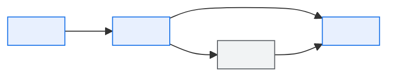

# \<Initiative Name\> — Business Requirements Document

> **Purpose.** State the business problem, the outcomes wanted, and how success will be
> measured. **Do not prescribe a solution** — that is the HLD's job, and prescribing it here
> removes the design space before anyone has explored it.
>
> **Test for a requirement:** could two competent teams build different things that both
> satisfy it? If no, you have written a design. If it cannot be verified, it is a wish.

---

## Contents

| Section | Summary |
| --- | --- |
| [1. Summary](#1-summary) | Initiative, sponsor, product owner, timeframe |
| [2. Business case](#2-business-case) | Drivers with evidence, and the cost of the status quo |
| [3. Scope](#3-scope) | In scope, out of scope, and priority per area |
| [4. Stakeholders](#4-stakeholders) | Stakeholders with interest, influence, engagement approach |
| [5. Current state](#5-current-state) | How it works today, and the pain points the change addresses |
| [6. Requirements](#6-requirements) | Numbered requirements with priority, rationale, acceptance criteria, source |
| [7. Non-functional requirements](#7-non-functional-requirements) | Business-stated non-functional requirements, with numbers and measurement |
| [8. Data requirements](#8-data-requirements) | Data needed, availability, gaps, and reporting requirements |
| [9. External impact](#9-external-impact) | External parties affected, notice required, agreements needed |
| [10. Compliance](#10-compliance) | Regulatory and policy obligations, and the evidence each needs |
| [11. Success criteria](#11-success-criteria) | Success criteria with measure, target, timing, and the definition of done |
| [12. Risks and dependencies](#12-risks-and-dependencies) | Risks, dependencies, and issues with mitigation and owner |
| [13. Open questions](#13-open-questions) | Open questions, whether blocking, owner, needed-by date |
| [14. Approval](#14-approval) | Sign-off roles and dates |
| [Change log](#change-log) | Version, date, author, change |

---

## 1. Summary

| | |
| --- | --- |
| Initiative | |
| Sponsor | |
| Product owner | |
| Business area | |
| Target delivery | |
| Budget | |
| Priority | |

**Problem statement** *(what is wrong today, with evidence)*

**Desired outcome** *(what "fixed" looks like, in business terms)*

---

## 2. Business case

| Driver | Detail | Evidence |
| --- | --- | --- |
| | | |

**Cost of the status quo**

| Cost | Annual | Basis |
| --- | --- | --- |
| Manual effort | | |
| Errors and rework | | |
| Lost revenue / opportunity | | |
| Penalties / SLA credits | | |
| Risk exposure | | |

**Expected benefit**

| Benefit | Measure | Baseline | Target | Realised by | Owner |
| --- | --- | --- | --- | --- | --- |
| | | | | | |

---

## 3. Scope

**In scope**

| Area | Description | Priority |
| --- | --- | --- |
| | | Must / Should / Could |

**Out of scope**

| Area | Why | Future consideration |
| --- | --- | --- |
| | | |

**Assumptions**

| ID | Assumption | If invalid | Owner | Verify by |
| --- | --- | --- | --- | --- |
| A-01 | | | | |

**Constraints**

| ID | Constraint | Type | Source |
| --- | --- | --- | --- |
| C-01 | | Budget / Time / Regulatory / Technical / Organisational | |

---

## 4. Stakeholders

| Stakeholder | Role | Interest | Influence | Engagement |
| --- | --- | --- | --- | --- |
| | | | | |

---

## 5. Current state

**How it works today**

**Pain points**

| Pain point | Frequency | Impact | Current workaround | Cost |
| --- | --- | --- | --- | --- |
| | | | | |

---

## 6. Requirements

| ID | Requirement | Priority | Rationale | Acceptance criteria | Source |
| --- | --- | --- | --- | --- | --- |
| BR-001 | | Must / Should / Could / Won't | | | |

### Requirement detail

#### BR-\<NNN\>: \<title\>

| | |
| --- | --- |
| Priority | |
| Requester | |
| Rationale | |
| Business value | |

**Statement**

*(What the business needs, not how to provide it.)*

**Acceptance criteria**

| # | Given | When | Then |
| --- | --- | --- | --- |
| 1 | | | |

**Business rules involved**

| Rule | New/Changed | Description |
| --- | --- | --- |
| | | |

**Volumes**

| Dimension | Value |
| --- | --- |
| | |

---

## 7. Non-functional requirements

| ID | Category | Requirement | Rationale | Measurement |
| --- | --- | --- | --- | --- |
| NFR-001 | | | | |

> Business-stated NFRs, with numbers. "Fast enough that a dealer does not abandon the
> order" becomes "order submission acknowledged within 3 seconds at p95" in the
> [NFR document](../01-architecture/nfr-and-quality-attributes.md) — but the business
> rationale belongs here.

---

## 8. Data requirements

| Requirement | Data needed | Source | Available | Gap |
| --- | --- | --- | --- | --- |
| | | | | |

**Reporting requirements**

| Report | Audience | Contents | Frequency | Metrics |
| --- | --- | --- | --- | --- |
| | | | | |

---

## 9. External impact

| Party | Impact | Notice required | Agreement needed | Owner |
| --- | --- | --- | --- | --- |
| | | | | |

---

## 10. Compliance

| Requirement | Source | Impact | Evidence needed |
| --- | --- | --- | --- |
| | | | |

---

## 11. Success criteria

| Criterion | Measure | Target | Measured when | Owner |
| --- | --- | --- | --- | --- |
| | | | | |

**Definition of done**

| # | Criterion |
| --- | --- |
| 1 | All Must requirements delivered and accepted |
| 2 | NFRs verified |
| 3 | Documentation updated |
| 4 | Support model in place |
| 5 | Benefit measurement baselined |

---

## 12. Risks and dependencies

| ID | Type | Description | Impact | Mitigation | Owner |
| --- | --- | --- | --- | --- | --- |
| | Risk / Dependency / Issue | | | | |

---

## 13. Open questions

| ID | Question | Blocking | Owner | Needed by |
| --- | --- | --- | --- | --- |
| Q-001 | | | | |

---

## 14. Approval

| Role | Name | Date | Signature |
| --- | --- | --- | --- |
| Business sponsor | | | |
| Product owner | | | |
| Technology lead | | | |
| Finance | | | |

---

## Change log

| Version | Date | Author | Change |
| --- | --- | --- | --- |
| 0.1.0 | | | Initial draft |
