# \<Initiative Name\> — Cutover and Migration Plan

> **Purpose.** The minute-by-minute runsheet for going live, including migration,
> verification, rollback, and hypercare.
>
> **Rehearsal is not optional.** A cutover executed for the first time in production is a
> plan, not a procedure. Rehearse at full data volume; the timings from a subset rehearsal
> are misleading in exactly the direction that hurts.

---

## 1. Summary

| | |
| --- | --- |
| Initiative | |
| Cutover date/window | |
| Duration | |
| Downtime required | |
| Cutover manager | |
| Approach | Big bang / Phased / Parallel run / Trickle |
| Rollback deadline | |
| **Point of no return** | |

**Approach rationale**

---

## 2. Readiness

| # | Criterion | Owner | Evidence | Status |
| --- | --- | --- | --- | --- |
| 1 | UAT signed off | | | |
| 2 | No open Sev 1/2 defects | | | |
| 3 | Performance validated at production volume | | | |
| 4 | Migration rehearsed successfully | | | |
| 5 | Rollback rehearsed successfully | | | |
| 6 | External parties notified and ready | | | |
| 7 | Runbooks updated | | | |
| 8 | Monitoring and alerts in place | | | |
| 9 | Support team briefed | | | |
| 10 | Backups verified | | | |
| 11 | Change approved | | | |
| 12 | Business freeze communicated | | | |
| 13 | Hypercare roster confirmed | | | |
| 14 | Go/no-go criteria agreed | | | |

---

## 3. Go/no-go

| Checkpoint | When | Decision maker | Criteria | Outcome |
| --- | --- | --- | --- | --- |
| T-7 days | | | | |
| T-1 day | | | | |
| T-0 start | | | | |
| Mid-cutover | | | *(named as the last point rollback is cheap)* | |
| Final verification | | | | |

---

## 4. Runsheet

> Every step: owner, duration, verification, and whether it is reversible. Timings from the
> rehearsal, not estimates.

| # | Time | Step | Owner | Duration | Depends on | Verification | Reversible | Status |
| --- | --- | --- | --- | --- | --- | --- | --- | --- |
| 1 | T-0 | Confirm go decision | | | | | — | |
| 2 | | Notify stakeholders — start | | | | | — | |
| 3 | | Stop inbound interfaces | | | | | ✅ | |
| 4 | | Quiesce batch schedule | | | | | ✅ | |
| 5 | | Confirm no in-flight transactions | | | | | ✅ | |
| 6 | | **Take full backup** | | | | | — | |
| 7 | | Verify backup restorable | | | | | — | |
| 8 | | Deploy application | | | | | ✅ | |
| 9 | | Run schema migration | | | | | ⚠️ | |
| 10 | | Run data migration | | | | | ⚠️ | |
| 11 | | Reconcile migrated data | | | | | — | |
| 12 | | **Go/no-go checkpoint** | | | | | — | |
| 13 | | Smoke test | | | | | — | |
| 14 | | Re-enable batch schedule | | | | | ✅ | |
| 15 | | Re-enable interfaces | | | | | ✅ | |
| 16 | | Business verification | | | | | — | |
| 17 | | Notify stakeholders — complete | | | | | — | |
| 18 | | Enter hypercare | | | | | — | |

```mermaid
gantt
    dateFormat HH:mm
    axisFormat %H:%M
    title Cutover timeline
    section Prepare
    Stop interfaces      :a1, 18:00, 15m
    Quiesce batch        :a2, after a1, 15m
    Backup               :crit, a3, after a2, 60m
    section Migrate
    Deploy               :b1, after a3, 30m
    Schema migration     :crit, b2, after b1, 45m
    Data migration       :crit, b3, after b2, 120m
    Reconcile            :b4, after b3, 45m
    section Verify
    Smoke test           :c1, after b4, 30m
    Business verify      :c2, after c1, 60m
    section Resume
    Re-enable            :d1, after c2, 30m
```

---

## 5. Data migration

| Dataset | Records | Source | Target | Method | Duration | Verification |
| --- | --- | --- | --- | --- | --- | --- |
| | | | | | | |

**Reconciliation**

| Check | Method | Tolerance | Owner | Blocking |
| --- | --- | --- | --- | --- |
| Record counts | | 0 | | ✅ |
| Control totals | | 0 | | ✅ |
| Key integrity | | 0 orphans | | ✅ |
| Sample field comparison | | | | ✅ |
| Aggregate comparison by dimension | | | | ✅ |
| Historical report reproduction | | | | |

**In-flight transactions**

| State at cutover | Handling | Volume | Owner |
| --- | --- | --- | --- |
| | | | |

> In-flight items are where cutovers go wrong. An order part-way through decode, a dispatch
> file transmitted but not acknowledged, a hold released but not yet actioned — each needs a
> decision made in advance, not discovered at 02:00.

---

## 6. Rollback

| | |
| --- | --- |
| Decision point | |
| Decision maker | |
| Trigger criteria | |
| Duration | |
| Data loss implications | |
| **Point of no return** | *(and precisely why — e.g. "once the dispatch file has been transmitted to vendors it cannot be recalled")* |

| # | Step | Owner | Duration | Verification |
| --- | --- | --- | --- | --- |
| 1 | | | | |

**Post-rollback**

| Action | Owner |
| --- | --- |
| Notify stakeholders | |
| Confirm data consistency | |
| Re-enable pre-change processing | |
| Reconcile with external parties | |
| Schedule retrospective | |

---

## 7. External coordination

| Party | Impact | Notified | Action required from them | Contact during cutover | Confirmed ready |
| --- | --- | --- | --- | --- | --- |
| | | | | | |

**Interface suspension**

| IF ID | Suspended from | Resumed by | Backlog expected | Backlog clearance | Counterparty informed |
| --- | --- | --- | --- | --- | --- |
| | | | | | |

---

## 8. Communications

| Audience | Message | Timing | Channel | Owner |
| --- | --- | --- | --- | --- |
| | Pre-cutover notice | T-7d | | |
| | Reminder | T-1d | | |
| | Start | T-0 | | |
| | Progress | Hourly | | |
| | Completion | | | |
| | Issues / delay | As needed | | |

**Bridge**

| | |
| --- | --- |
| Location | |
| Opens | |
| Required attendees | |
| Escalation | |

---

## 9. Verification

| # | Check | Method | Owner | Expected | Blocking |
| --- | --- | --- | --- | --- | --- |
| 1 | Application available | | | | ✅ |
| 2 | Key transactions succeed | | | | ✅ |
| 3 | Data reconciliation passes | | | | ✅ |
| 4 | Interfaces connected | | | | ✅ |
| 5 | First batch cycle completes | | | | ✅ |
| 6 | External transmissions accepted | | | | ✅ |
| 7 | Reports produce expected figures | | | | |
| 8 | Performance within NFRs | | | | |
| 9 | No duplicate processing | | | | ✅ |

---

## 10. Hypercare

| | |
| --- | --- |
| Duration | |
| Enhanced support hours | |
| Roster | |
| Daily checkpoint | |
| Escalation | |
| Exit criteria | |

**Daily checks**

| Check | Owner | Threshold for concern |
| --- | --- | --- |
| | | |

---

## 11. Rehearsal record

| Rehearsal | Date | Scope | Duration | Issues found | Plan updated |
| --- | --- | --- | --- | --- | --- |
| | | | | | |

**Timing comparison**

| Step | Estimated | Rehearsal actual | Used in plan |
| --- | --- | --- | --- |
| | | | |

---

## 12. Risks

| Risk | Likelihood | Impact | Mitigation | Contingency | Owner |
| --- | --- | --- | --- | --- | --- |
| | | | | | |

---

## 13. Contacts

| Role | Name | Contact | Availability |
| --- | --- | --- | --- |
| | | | |

---

## Change log

| Version | Date | Author | Change |
| --- | --- | --- | --- |
| 0.1.0 | | | Initial draft |
